# fab-optimization

A wafer fab is the hardest scheduling problem in manufacturing. A silicon lot
makes hundreds of passes through the same few hundred machines, revisiting the
same toolsets at different stages — so the queue you join depends on every
decision made before it. Machines break down, need preventive maintenance,
require setup changes between recipes, and some process wafers in batches that
must be filled. Every time a machine frees up, something has to choose which
waiting lot goes next. That choice is the **dispatching rule**, and it is made
tens of thousands of times a day.

This project replays a full virtual fab from the public SMT2020 testbed so
those rules can be compared on identical demand, identical breakdowns and
identical machine sets — something impossible in a real $10B fab — and builds
a dispatcher to beat the rules the testbed ships with.

Lot dispatching for a 300mm fab, plus the simulator used to judge whether the
dispatching is any good. The two halves live in one repository for exactly one
reason: **they must read the same data.**

```
dispatch/            the C++ stack (fabdisp) — four zones, sub-ms fast path
baselines/pyscfabsim/  discrete-event fab simulator + PPO agent (vendored, read-only)
data/smt2020/        the shared SMT2020 load — the reason this is one repo
                     (LVHM is the standard scenario; see docs/adr/0001)
bench/               comparison harness, per-tool probe, committed results
docs/adr/            why things are the way they are, and what would change them
scripts/             dev-up.sh and friends
```

Start with [`docs/adr/0000`](docs/adr/0000-motivation-scope-and-boundaries.md)
for what this project is for and, more usefully, what it is not.

If the dispatcher and the simulator are fed different SMT2020 loads, every
number comparing them is meaningless, and nothing in either program would tell
you. One `data/` directory, symlinked into the baseline, removes that failure
mode. That symlink is load-bearing: if it is ever broken, stop.

## What it solves

Nobody can A/B a dispatching rule in a real fab: the demand, the breakdowns
and the machine set are never the same twice, so a rule that looks better
this quarter may simply have had an easier quarter. Here every candidate
starts from the *same* warmed-up fab — 90 simulated days under `fifo`,
checkpointed — and runs on identical demand and identical breakdowns, so
the only thing that differs between two rows is the rule. That is the page
the whole project exists to fill honestly:

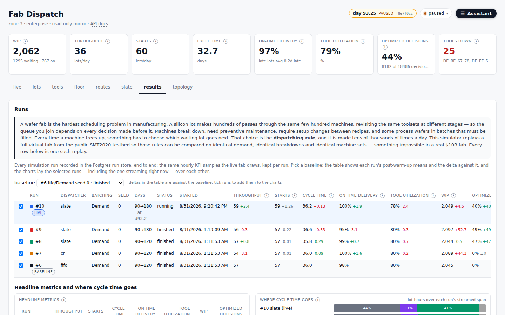

Every run in the Postgres run store, each resumed from the same day-90
checkpoint: the streaming run beside finished `fifo`, `cr` and `slate`
benchmark rows, with post-switch means and deltas against a chosen baseline,
per-KPI series laid over each other, where cycle time goes (queueing,
batch-holding, processing, delay steps), and the busiest tools per run.
`bench/README.md` says what the numbers do and do not say.

### The KPIs

The numbers on that page are the same KPIs that head every page of the
dashboard, each with an (i) that states its definition.
The header of every page carries the fab KPIs, each with an (i) that states
its definition; the live tab draws them from day 0. They are **computed by
the producer**, not the dashboard: `sim_feed.py` samples them once per
simulated hour over a trailing simulated day, during warm-up and live alike,
and publishes them on the compacted `fab.kpi.state` topic keyed by run
(one `KPI_HIST` record with the warm-up series, then one `KPI` record per
hour). The mirror only draws them. That is deliberate: warm-up and live —
and, later, the fifo baseline and the dispatcher — are then measured by one
piece of code, so an A/B compares like with like.

| KPI | definition |
|---|---|
| WIP | lots released and not complete (waiting + on a tool) |
| throughput | lots that completed their route in the trailing day |
| starts | lots released in the trailing day — today the dataset's `order.txt` schedule verbatim; the number a release policy (CONWIP, workload regulation, mix) would be judged on |
| cycle time | mean release→complete of those lots, days |
| on-time delivery | share of those lots done by their due date; mean tardiness of the late ones alongside |
| tool utilization | share of real tools with a lot processing at the sample instant; the `Delay_*` pseudo-toolset (400 stations for fixed waits, ADR 0008) is excluded |
| where cycle time goes | lot-hours in the trailing day spent queueing for a tool, holding for batch partners, processing on a real tool, and sitting in route-prescribed delay steps — as shares |
| busiest tools / toolsets | per run: share of the streamed span each tool had a lot on it, dispatches, queue seen at dispatch; rolled up by family |
| optimized decisions | dispatch decisions in the trailing day that did **not** fall back to the default rule — 0% for the fifo baseline by construction. A dispatcher running inside the simulator stamps `instance.dispatch_source` before `instance.dispatch()`; anything not `rule:*` counts |

`/api/kpi` returns the series; `/api/state` carries the latest sample.

## Architecture

```
   ┌──────────── zone 1: equipment ────────────┐
   │  equipment-sim ──HSMS/SECS-II over TCP──> │
   │                        amhs-adapter       │   no browser reaches here
   └────────────────────────┬──────────────────┘
                            │ ZeroMQ
   ┌────────────────────────▼─── zone 2: realtime ──────────────────────┐
   │                                                                    │
   │   ingest ──> FabState ──> planner ──(CP-SAT, 30-60s)──> Slate      │
   │   (single writer)              │                    (atomic swap)  │
   │                                ▼                                   │
   │   move request ──> slate lookup (~200 ns) ──> decision             │
   └────────────────────────┬───────────────────────────────────────────┘
                            │ Kafka
   ┌────────────────────────▼─── zone 3: data ──────────┐
   │   kafka · postgres · api (read-only)               │
   └────────────────────────┬───────────────────────────┘
                            │ HTTP (nginx)
   ┌────────────────────────▼─── zone 4: enterprise ────┐
   │   ui — React dashboard                             │
   └────────────────────────────────────────────────────┘
```

The zones are enforced by separate Docker networks, not convention. No service
touches both the tools and a browser. `dispatch/infra/zones.yaml` is the
declaration; `dispatch/infra/verify-zones.sh` checks it.

## The components

**The simulator** — `baselines/pyscfabsim/`. A discrete-event model of the fab:
multi-step routes with rework, setup matrices with minimum-run-lengths,
batching, time- and piece-based PM, breakdowns, due dates. Runs 730 simulated
days and reports cycle time, throughput, on-time %, tardiness, utilization.
Pinned upstream at `ae3d55ef`, read-only — changes belong in `dispatch/` or
`bench/`. See its `UPSTREAM.md`. What it simplifies — transport is one
uniform draw for the whole fab, delays are a 400-station pseudo-toolset,
there is no storage and queue-time constraints are parsed but not enforced —
and what that hides from an A/B, is inventoried in
[`docs/adr/0008`](docs/adr/0008-what-pyscfabsim-simplifies.md). It plays three roles: fast batch KPI runs for
scenario comparison, paced playback for watching one tool, and (designed, not
built) the environment the dispatcher itself runs inside.

**The dispatch solver** — `dispatch/include/fab/solver.hpp`. A single-period
assignment: one Boolean per feasible (lot, tool) pair, at-most-one tool per lot,
tool capacity, batch-furnace firing bounds, reticle exclusivity. CP-SAT via
OR-Tools when linked, a cost-ordered greedy otherwise. There is **no time
index** — it assigns, it does not sequence. Backends announce whether they are
actually linked, so an unlinked solver cannot masquerade as a tie with greedy.

**The planner and slate** — `planner.hpp`, `slate.hpp`. The planner solves on a
cycle and publishes an immutable `Slate` by atomic pointer swap. The real-time
path never calls a solver: it reads the slate and answers in ~200 ns, falling
back to an alternate tool if the primary went down mid-cycle. This split is the
core design claim of the system.

**The producer** — `producer_sim.hpp`. A load generator, not a fab model: a
hardcoded product mix, random priorities, coin-flip tool downs. It exists so the
ready pool does not grow unbounded while the pipeline is exercised. Anything
that needs fab physics uses the simulator instead.

**The stores** — two, with different jobs. **Kafka** holds live state: the
compacted `fab.lot.state` / `fab.tool.state` topics are the keyed,
restart-survivable record the dashboard bootstraps from, which is what solves
cold start (see below). **Postgres** (`infra/postgres-init.sql`) is the *run*
store — runs, KPIs and per-tool outcomes, for comparing dispatchers across
seeds and scenarios. It deliberately holds no live fab state; giving the same
fact two homes is how they drift.

**The transport** — `transport.hpp` (Kafka), `zmq_transport.hpp` (ZeroMQ),
`hsms.hpp` and `secs2.hpp` (equipment protocol). SECS-II is real; HSMS is a
state machine with the wire codec stubbed; the Kafka bodies are sketched against
librdkafka and not yet compiled.

**The viewer** — one of them now. `dispatch/ui/` is a React 18 + Vite
dashboard reading the Flask API (`/api/state`, `/api/stream`, `/api/kpi`,
`/api/runs`, `/api/lots`, `/api/zones`). The what-if tab that called
`/api/scenario/compare` — the C++ planner re-assigning a synthetic instance
with tools marked down — is gone from the UI; the endpoint stays for
`scripts/smoke.sh`, which is what exercises the C++ path. `bench/tools/tool_probe.py` used to carry a second
one: a `--follow` mode that drew its own terminal view of a tool with its own
pacing and breakpoints, over a private copy of the run loop. That is gone. The
probe is now headless-only — run the window, report the time budget — and both
it and `sim_feed.py` drive the simulator through `bench/tools/sim_runner.py`,
so a measured run and a published run are the same run rather than two.

What remains of the unification is the transport: the probe still computes the
per-tool time budget in-process instead of publishing `EquipmentState` onto the
stream the API already speaks. Once it does, the React tool view can show the
busy/setup/pm/down/blocked/starved split that today only the terminal has.

## A tour of the dashboard

Captured from a live session: the fab warmed up for 90 simulated days under
`fifo`, the CP-SAT slate dispatcher switched on at day 90, paused at day
93. Every number on these screens is computed by the simulator feed, not
the browser, which is what makes a live run comparable with a benchmark row.

### Live — the fab right now
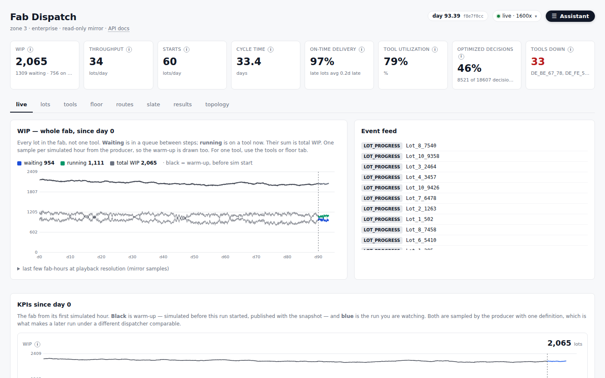

The digital twin's front page. The header carries the fab KPIs — WIP,
throughput, starts, cycle time, on-time delivery, tool utilisation, and
**optimized decisions**, the share of the trailing day's dispatch decisions
the solver actually made rather than its fallback (44% here). Below it, WIP
split into waiting and running from day 0, the raw event feed, and every KPI
as a series with the warm-up in black and the run under test in blue, so the
effect of switching the dispatcher on is visible as a break at the day-90
rule rather than inferred from a table.

### Live — playback control and the assistant
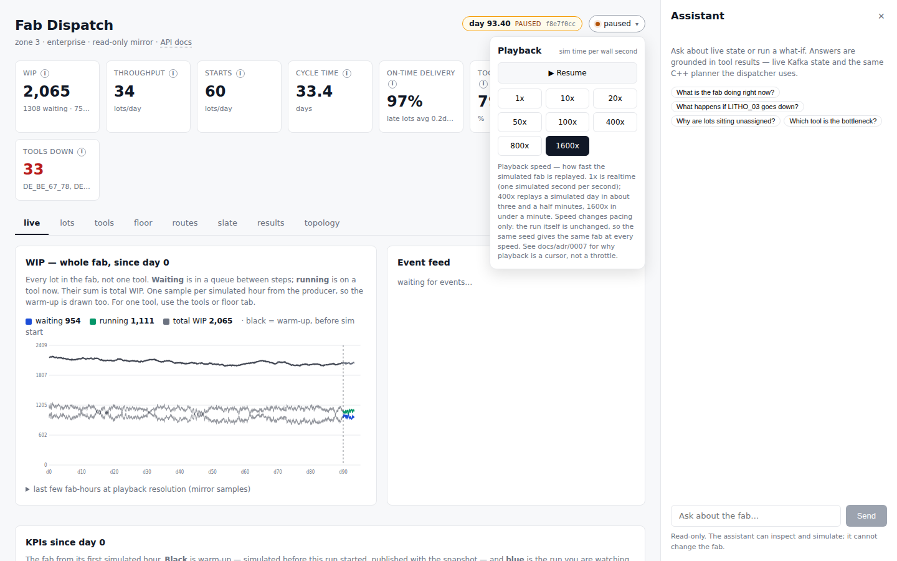

Two interactive features on the same page. **Playback** (the badge next to
the sim clock) pauses and resumes the simulated fab and sets the replay
speed from 1x to 1600x. It changes pacing only — the run, its seed and every
decision are unchanged, so the same fab can be watched slowly or raced
through; this is working, and the dashboard's choice persists across API
restarts. The **Assistant** rail is a conceptual mockup of where an
operator would ask the fab questions in plain language — "what happens if
LITHO_03 goes down?", "which tool is the bottleneck?" — with answers
grounded in the live state and the same C++ planner the dispatcher uses,
read-only by construction. The panel and its tool contract exist; it is not
wired to a model in this checkout.

### Lots — cohort burndown
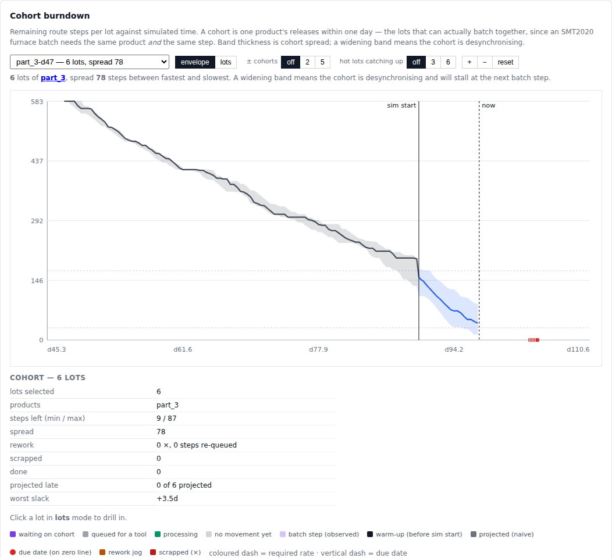

One product's releases from one day, drawn as steps-remaining against
simulated time — here six `part_3` lots released on day 47 with a 583-step
route, warm-up in black, the run under test in blue from the `sim start`
rule. A cohort is the set of lots that can actually share a furnace batch,
so the band's thickness is the cohort's spread and a widening band means it
is desynchronising and will stall at the next batch step — this one has
opened to 78 steps between fastest and slowest. The red dots on the zero
line are the due dates; a naive projection from the product's achieved rate
says whether they are in reach (`0 of 6 projected late`, worst slack
+3.5 d). Rework shows as a jog upward. This is the product-level view of
what the dispatch rule is doing.

The **lots** tab draws one cohort's burndown (steps left against simulated
time). Two toggles add context: **± cohorts** overlays the nearest earlier
(cyan) and later (orange) cohorts of the same product, nearest by release
*and* due date together so they are the ones that will actually meet it at a
batch step; **hot lots catching up** overlays the M hot lots (priority 20,
red dashed) of that product that are behind it in the route and released
nearest to it — the ones moving fast enough to contend for its batches.
`/api/lots?part=…` and `/api/lots/hot` serve them.

### Lots — one lot at a time
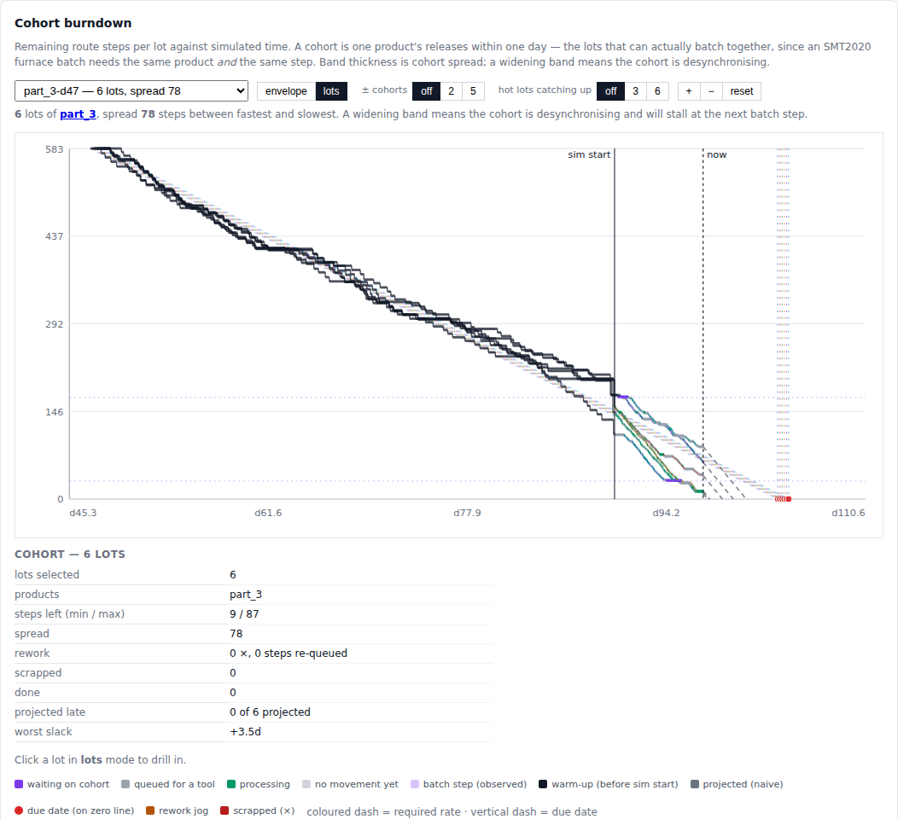

The same cohort view switched from **envelope** to **lots**: `part_3-d47`,
six lots released on day 47 with 583 steps ahead of them, each drawn as its
own line. Warm-up is black; from the `sim start` rule each lot is coloured
by what it is doing at the last point — waiting on its cohort for a batch
(purple), queued for a tool (grey), processing (green) — and the dashed
rays project each one to the zero line at the product's achieved rate, to
be read against its due-date dot. Here the cohort has spread to 78 steps
between fastest and slowest, yet 0 of 6 are projected late with 3.5 days
of slack on the worst. Clicking a line opens that lot.

### Tools — who is busy, who is down
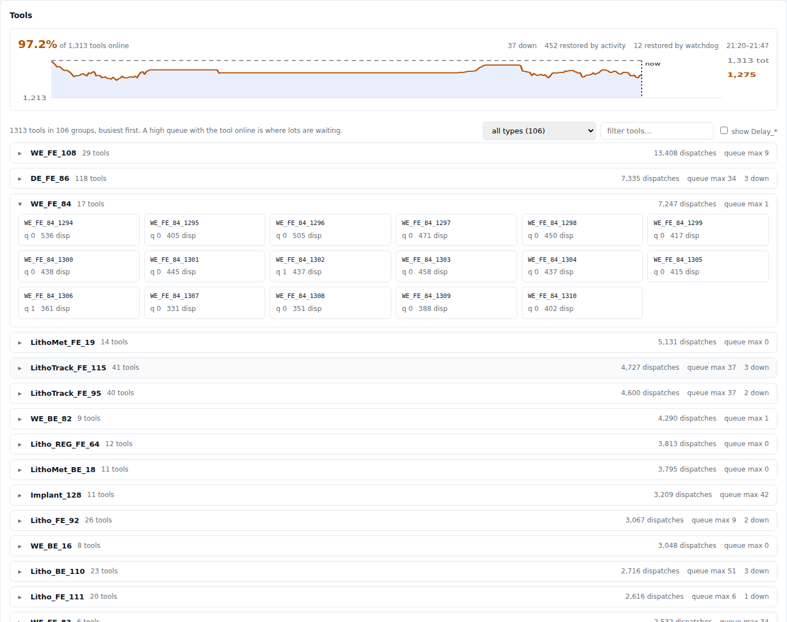

All 1,313 tools in 106 groups, busiest first, with the online roster over
time (breakdowns and PM take tools out; the feed brings them back, and a
watchdog holds the roster if an event is lost). Expanding a group — here
`WE_FE_84`, 17 wet-etch tools, 7,247 dispatches — shows each tool's queue
and dispatch count; queue depth beside an online tool is where lots are
waiting, i.e. where the dispatch decision matters most. Each tool card
drills down to its dispatches and the choice set it was offered.

### Tool — one machine's decisions
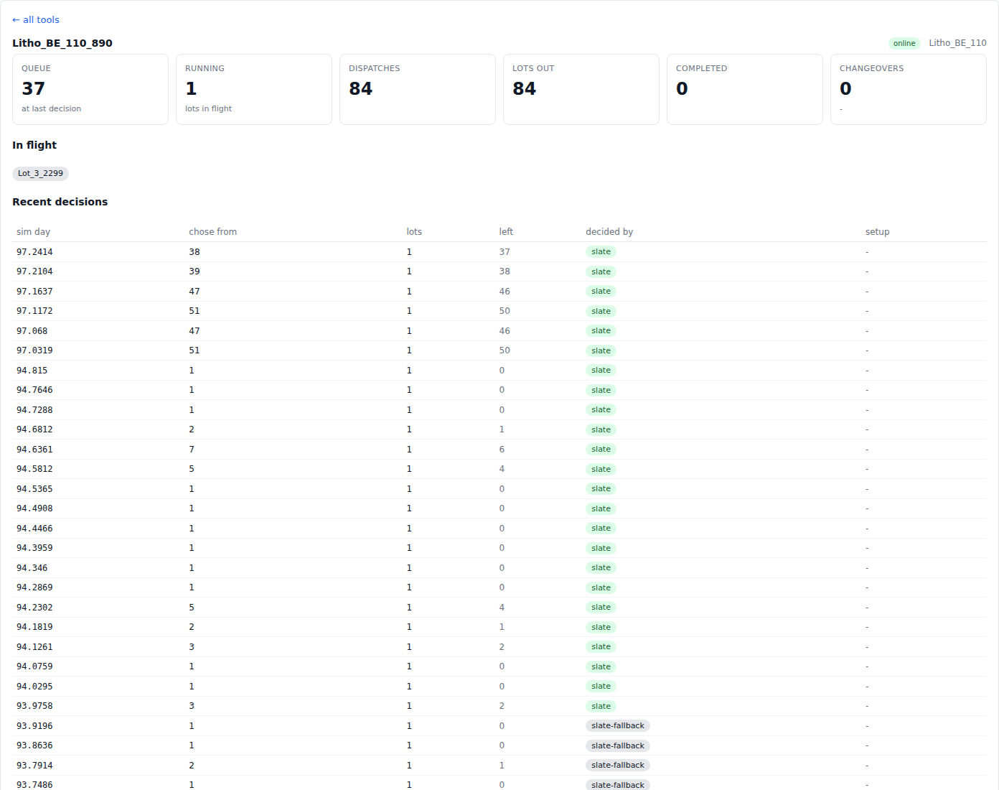

`#/tools/Litho_BE_110_890`: one lithography tool's queue, lots in flight,
dispatches and changeovers, and then every recent dispatch decision made at
it — the simulated day, how many lots it **chose from**, how many were left
waiting, and **who decided**: `slate` when the CP-SAT slate held a pick for
this tool, `slate-fallback` when the solver-consistent fallback score did.
This is the optimized-decisions KPI at decision resolution, and litho is
where it counts: at the top of the log the tool is choosing one lot from
38–51 waiting, and every one of those choices is the slate's. The
`slate-fallback` rows at the bottom are from the first hours after the
switch, before the planner had a token for this tool.

### Tool — setups and changeovers
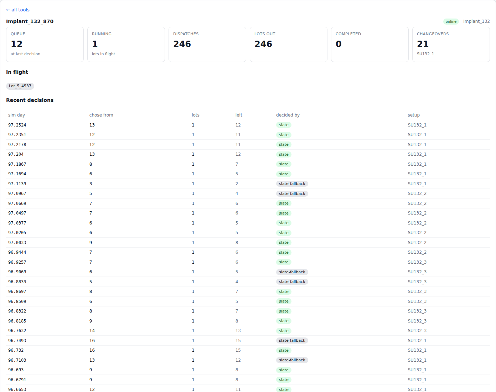

`#/tools/Implant_132_870`: the same page on an implanter, where the
**setup** column is the story. This tool has done 21 changeovers; reading
down the log it runs a block of lots in `SU132_1`, switches to `SU132_2`,
then `SU132_3`, then back — each switch costs setup time and, under
SMT2020's minimum-run-length rule, commits the tool to a run of that setup
before it may switch again. The dispatch rule sees the queue of 6–16 lots
across those setups and decides both which lot goes next and, implicitly,
when the tool pays for a changeover. This is the sequencing problem a
per-cycle assignment is blind to (see `docs/adr/0002`), visible one
decision at a time.

### Floor — the cleanroom as a map
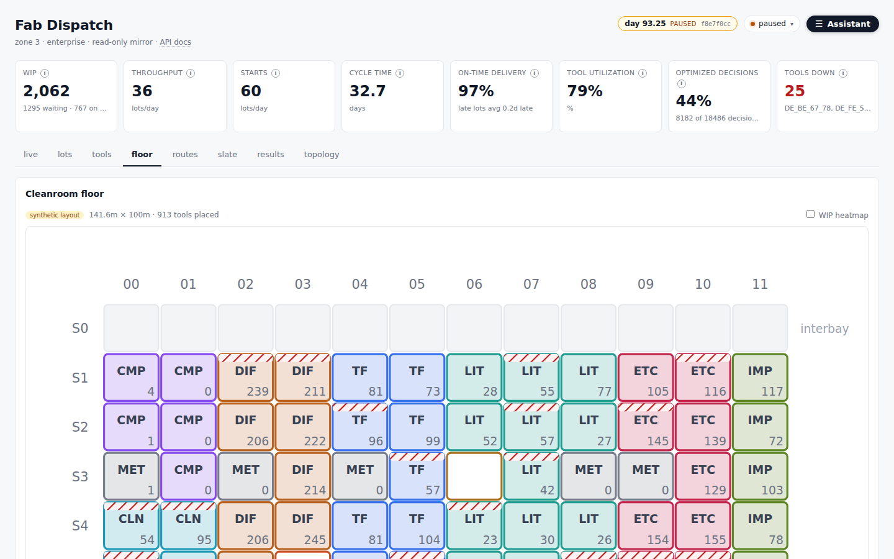

A synthetic bay/chase layout of the same 913 process tools, coloured by
area, with WIP per bay and a heatmap toggle. Hatching marks bays with a
tool down. Clicking a bay opens its panel — here bay 8 · seg 2,
photolithography: 14 tools, 77 lots of WIP, 11 running, 1 down, and the
tool list, each a link into the tools tab. It answers the spatial question
the tables cannot: where in the fab the queue is building, and whether it
is one bay or a whole area. The selection lives in the URL
(`#/floor?bay=8,2`), so a view is pasteable.

### Products — the ten routes at a glance
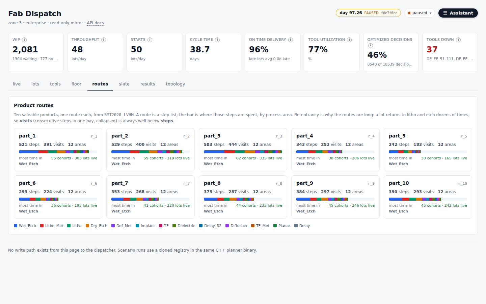

The ten saleable LVHM products, one card each: route length in steps,
**visits** (consecutive steps in one bay, collapsed — always well below
steps, which is the re-entrancy), the areas touched, a bar of where the
route's steps are spent by process area, and how many cohorts and lots of
that product are live in the fab right now. Routes run from 242 to 583
steps and every one of them spends most of its time in wet etch. Each card
opens the product's route page.

### Routes — what a product's journey looks like
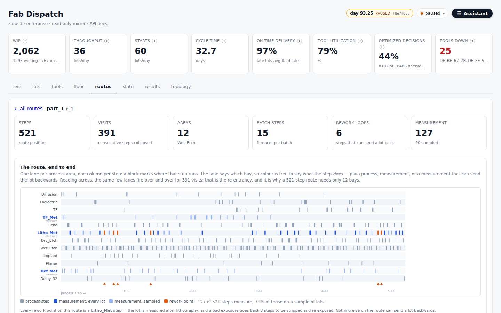

One page per product. The lane map draws the whole route — here 521 steps
across 12 areas — one lane per area, one column per step, with measurement
and rework points marked. Reading across shows the re-entrancy that makes
fab scheduling hard: the same few lanes fire over and over for 391 visits,
and a bad exposure sends the lot back three steps. The area table below
says where the steps go and how often the lot returns.

### Slate — the optimizer, on demand
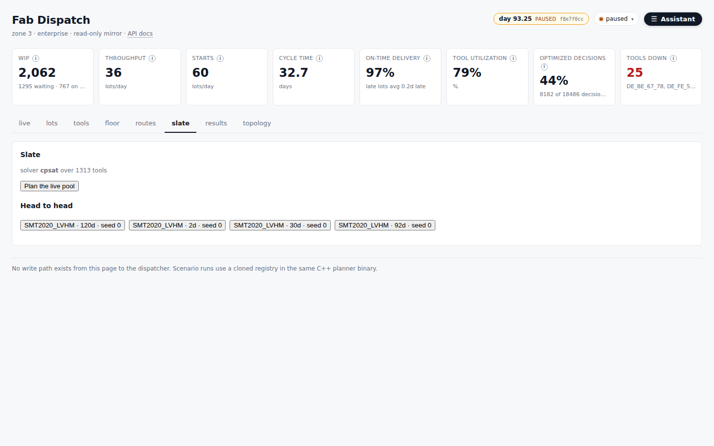

The CP-SAT planner from `dispatch/libfabslate.so`, the same library the
simulator's `slate` rule calls, applied to the live ready pool: one click
plans every waiting lot against every tool by family and returns the slate
— primary tool, alternate, rank. The head-to-head buttons open the
benchmark result files. This is the read-only window onto the dispatcher;
no write path reaches the fab from here.

### Results — dispatchers compared on equal terms

The screenshot at the top of this README. Every run in the Postgres run store,
each resumed from the same day-90 checkpoint, with post-switch means and
deltas against a chosen baseline — see [What it solves](#what-it-solves) and
`bench/README.md` for what the numbers do and do not say.

### Topology — the pipeline itself
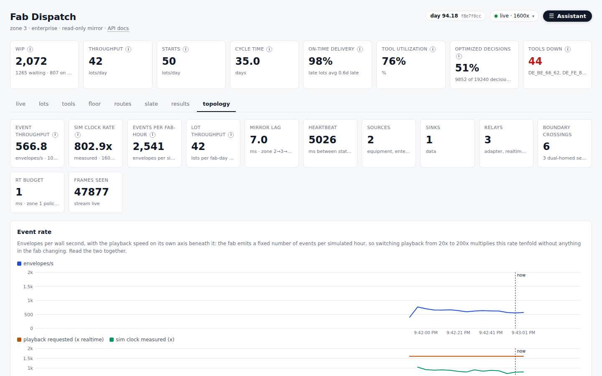

The four security zones and the stream between them: event throughput
(~570 envelopes/s here), the simulated clock rate *measured* against the
playback speed *requested* — 803x against 1600x, because the CP-SAT slate
cannot plan faster than that, so the gap is the solver's cost in fab time
— mirror lag from zone 2 to zone 3, frames seen, and which services
straddle a boundary. When the fab looks wrong, this is where to check
whether it is the fab or the pipe.

## Cold start

The dashboard is a **mirror**: it holds no state of its own and rebuilds the
fab from the event stream. That is the right design — it means the dashboard
can die, restart, or be opened for the first time mid-shift without anyone
coordinating — but on its own it cannot answer *"what is in the fab right
now?"* at the moment it connects.

It learns a lot exists only when that lot next **moves**. A lot sitting in a
litho queue announces nothing for hours of simulated time, and the ~2,000 lots
the simulator loads from `WIP.txt` are never *released* at all, so they emit
nothing until they happen to dispatch. A freshly started mirror therefore
under-reports WIP for as long as it takes every lot to touch a tool — and it
under-reports it *silently*, which is worse, because a low number looks like a
quiet fab rather than a blind observer.

Replaying history does not fix it. A year is ~15M events, minutes of consumer
time on every restart, and the answer you want is one number per lot, not the
path it took to get there.

**The fix is snapshot + delta.** The producer states the position of every lot
and tool once, as keyed records on a **compacted** Kafka topic, and streams
changes from there. Compaction is what makes this cheap: the log keeps exactly
one record per live key, so a consumer reading from the very beginning reads
*the fab*, not its history. `fab.lot.state` and `fab.tool.state` exist for
this and nothing else.

A discrete-event simulator cannot *start* at day 90 — it has to simulate
there, at roughly 3 minutes of CPU per 30 simulated days (about 35 s for the
default 5 days). So the warm-up is paid **once** and cached in
`bench/snapshots/`, keyed by dataset, seed, dispatcher, batch strategy and day:

- `…_dayN.json` — the dashboard snapshot (positions and per-lot warm-up
  history). `--snapshot-only` republishes it in ~2 s, which populates the
  dashboard but streams nothing.
- `…_dayN_hH.ckpt` — the **whole simulator** at the warm-up line: event
  queue, tool setups, RNG, and the feed's per-lot books. Any later start with
  the same key loads it in well under a second and streams live from day N,
  no re-simulation. `H` is the run horizon (`--days`); a checkpoint can serve
  any run of that length or shorter. `--rebuild` forces a fresh warm-up.

```bash
# first time — simulate 90 days silently, checkpoint, snapshot, stream live
baselines/pyscfabsim/.venv/bin/python3 bench/tools/sim_feed.py \
    --days 180 --warmup-days 90 --speed 20

# every time after — same command; resumes from the checkpoint in <1 s
```

**The warm-up is shared, the rule under test is not.** The checkpoint is
keyed by the rule that ran the warm-up (`--warmup-dispatcher`, default: the
run's own `--dispatcher`), and the rule that takes over at day N is a
separate choice. Warm up once under `fifo`, and `fifo`, `cr` and `slate`
each resume the *same* fab — same WIP, same tool setups, same pending
breakdowns, same RNG — and diverge from there. That is what makes two runs on
the Results tab an A/B rather than two histories; it is also why a `slate`
run does not have to pay hours of its own warm-up. If the warm-up checkpoint
is missing, the feed builds it first (a child `sim_feed.py --checkpoint-only`
under the warm-up rule) and then resumes from it.

```bash
# the dispatcher under test, from the shared fifo day-90 fab
baselines/pyscfabsim/.venv/bin/python3 bench/tools/sim_feed.py \
    --days 180 --warmup-days 90 --dispatcher slate --warmup-dispatcher fifo \
    --speed 1600
```

`slate` cannot sustain 1600x (about 100 s of wall per simulated day, most of
it CP-SAT), so that speed is effectively "unpaced" and the dashboard's speed
menu can still slow it down to watch.

A resumed run continues the same fab state but is not bit-identical to an
uninterrupted one: the simulator iterates a `set` of usable machines and the
set's layout changes across a pickle round-trip, so ties between equivalent
tools can break differently. The trajectory is a valid one, not a replay.

The API applies the snapshot before tailing events, so the dashboard is
populated the moment it starts rather than filling in over the next hour.

## Running it

### Start a fresh session

One command. It brings up Kafka and Postgres, starts the API and the UI, waits
for all three to answer, and starts a producer:

```bash
scripts/dev-up.sh --fresh --feed
```

Then open http://localhost:5173/.

| flag | what it does |
|---|---|
| `--feed` | start the simulator producer. Without it the dashboard is empty: the API consumer starts at `latest` and there is nothing to consume. |
| `--fresh` | drop the Kafka and Postgres volumes first, so no snapshot from an earlier run is bootstrapped. This is what "clean start" means here. |
| `--status` | what is listening |
| `--stop` | stop what the script started (it refuses to kill anything it did not) |

`FEED_DAYS` / `FEED_WARMUP` / `FEED_SPEED` / `FEED_RULE` / `FEED_WARMUP_RULE`
override the producer's defaults — 180 simulated days, a 90-day warm-up (so
the dashboard opens on a fab with a full quarter of history and steady-state
KPIs to compare against), 20x realtime, `fifo`, warm-up under `fifo`. The
first start simulates the warm-up (~10 min of CPU); later starts resume from
its checkpoint in under a second. `FEED_RULE=slate FEED_SPEED=1600
scripts/dev-up.sh --feed` is the dispatcher under test taking over the same
fab at day 90.

Run it directly rather than through a pipe; see the note at the top of the
script.

**Why one command rather than three terminals.** `--feed` starts a *single*
producer that publishes the WIP snapshot and then streams from the same point.
Two processes would mean two producer run ids, and the dashboard would be
drawing a snapshot from one run against a live stream from another — which it
will now tell you about (the header badge goes red), but is better not to do.
See [`docs/adr/0003`](docs/adr/0003-cold-start-snapshot-and-delta.md).

### Runs and the results tab

Every `sim_feed.py` run also records itself in the **Postgres run store**
(ADR 0004): a `runs` row at start (dataset, seed, dispatcher, batching,
horizon, warm-up, git sha, the Kafka `run` key), every hourly KPI sample in
`run_kpi_samples` as it is taken, and on exit a status (`finished`, or
`stopped` for Ctrl-C/SIGTERM) plus post-warm-up means in `run_kpis`.
`--no-store` opts out; `--notes` says what a run was for.

The **results** tab reads that store (`/api/runs`, `/api/runs/<id>/kpi`):
a table of every run with its means and deltas against a chosen baseline,
and per-KPI charts laying the selected runs over each other — including the
run currently streaming, whose line grows live. SMT2020 has several
out-of-the-box rules (`fifo`, `cr`, two `lifo`s, `random`) and four batching
strategies, so "baseline" is a choice, not a property; the default is the
oldest finished fifo run.

To record a baseline without disturbing the live dashboard, run the feed
headless into a file, with its own control file so it cannot change the
live feed's pacing:

```bash
SIM_CONTROL_FILE=/tmp/ctl.json baselines/pyscfabsim/.venv/bin/python3 \
    bench/tools/sim_feed.py --days 120 --warmup-days 90 --speed 0 \
    --dispatcher cr --warmup-dispatcher fifo \
    --out /tmp/cr.jsonl --truncate --notes "cr baseline"
```

With `--warmup-dispatcher fifo` every baseline resumes the same day-90
checkpoint the live run did, so the rows on the Results tab differ only in
the rule. Without it, the first run of a new dispatcher pays its own 90-day
warm-up and the rows compare two histories.

### Watching it

The header badge is the simulated fab clock. It shows the current sim day, the
producer run id, and turns red if the snapshot and the live stream are from
different runs. Clicking it returns to the live view.

`--speed` is sim-seconds per wall-second: `1` is realtime, `20` (the default)
is twenty times realtime, `0` is unpaced. The dashboard's menu goes to
1600x; measured, the feed holds the requested rate within 3% to 2000x and
the simulator itself tops out near 10,000x. Playback is the only throttle in
the pipeline, and [`docs/adr/0007`](docs/adr/0007-playback-is-a-cursor-not-a-throttle.md)
is the case for making it a viewer-side cursor over the recorded stream
rather than a producer-side sleep. The dashboard's playback menu changes
it live, and that setting persists in `bench/.sim_control.json` — **if the
clock is not moving, check there first**: a leftover `"paused": true` from an
earlier session leaves the feed running but silent.

### The two modes

The simulator runs in two modes — the same run loop
(`bench/tools/sim_runner.py`) with a different plugin riding it.

*Mode 1 — headless.* No broker, no feed, no pacing, as fast as possible. This
is what you use for KPIs and parameter tuning:

```bash
baselines/pyscfabsim/.venv/bin/python3 bench/tools/tool_probe.py --days 30 --top 15
```

*Mode 2 — producer.* What `--feed` starts. To run it by hand, for a different
dataset or start day:

```bash
baselines/pyscfabsim/.venv/bin/python3 bench/tools/sim_feed.py \
    --days 40 --warmup-days 0 --speed 20
```

`--warmup-days 0` snapshots the WIP the dataset already ships with (~2,200
lots) and streams from there, at no warm-up cost. A later start day has to be
simulated to — roughly 3 minutes of CPU per 30 simulated days on an idle
machine, considerably more on a busy one — and is cached in `bench/snapshots/`
afterwards, so only the first build of a given day is slow.

**Tests:**

```bash
cd dispatch && make test        # 56/56, the C++ suite
scripts/smoke.sh                # end-to-end: API, producer, floorplan, scenario
python3 bench/tools/t_sim_runner.py   # the shared dispatch loop, any interpreter
```

`smoke.sh` runs on :8111 so it can stand beside a running dev API. Every
assertion in it corresponds to a bug that actually shipped.

`t_sim_runner.py` is the one test here that needs nothing — no venv, no
dataset, no broker. It fakes the instance to pin the loop in
`bench/tools/sim_runner.py`, which both `tool_probe.py` and `sim_feed.py` run
on, so a break there would take out the measurements and the dashboard feed
together. `smoke.sh` runs it first for that reason.

**The full four-zone stack:**

```bash
cd dispatch
make infra-up     # docker compose, four networks

# or one zone at a time — profiles: equipment · realtime · data · enterprise
cd infra && docker compose --profile data up -d
# containers are named fab-<zone>-<service>, e.g. fab-data-kafka

make verify       # zone declarations
make reach        # reachability — proves the isolation is real
make logs
make infra-down
```

**The dispatcher on its own:**

```bash
cd dispatch
make test                       # 56/56, greedy-only build
make hsms-test                  # two processes, real TCP, real HSMS handshake
make bench                      # prints which backends are linked FIRST
./build-ortools/fabtest --bench 5   # CP-SAT vs greedy, if built per BUILD.md
```

**The simulator:**

```bash
cd baselines/pyscfabsim
.venv/bin/python3 main.py       # 730-day greedy run, writes KPIs

# per-tool view (from the repo root)
baselines/pyscfabsim/.venv/bin/python3 bench/tools/tool_probe.py --days 30 --top 15
baselines/pyscfabsim/.venv/bin/python3 bench/tools/tool_probe.py \
    --days 30 --tool 970 --tail 40
```

The probe is headless: it runs the window as fast as it can and reports. To
watch a run unfold, feed the dashboard with `bench/tools/sim_feed.py` and use
its playback controls — that path pages through Kafka's log, so nothing has to
re-simulate to redraw. Recording a bespoke stream instead would be ~2.5 GB per
730-day scenario at 22.5k dispatch events per simulated day, which is the
argument for letting the log be the recording.

## Considerations and enhancements

Things worth doing that are specified but not built. Each has an ADR so
the reasoning survives the backlog.

- **Playback as a cursor** ([0007](docs/adr/0007-playback-is-a-cursor-not-a-throttle.md)).
  Run the simulation and dispatcher unpaced; the mirror advances a
  sim-time watermark at the viewer's speed. The solver's latency is charged
  in fab time, so its budget is exact at any playback speed.
- **Look-ahead dispatch — the hold decision** ([0010](docs/adr/0010-look-ahead-dispatch-the-hold-decision.md)).
  Let a tool wait for a lot it can see coming — out of a delay step, off a
  known process end — when that buys a setup match, a full batch, or a hot
  lot, and only on tools with slack. Needs a "hold until *t*" return from
  the rule, a wake event, and a *held for arrival* bucket in the cycle-time
  split so the cost is visible beside the gain.
- **Downstream-aware dispatch** ([0011](docs/adr/0011-downstream-aware-dispatch.md)).
  The other half of look-ahead: push need *back* up the route, so an
  upstream tool sequences for the litho bottleneck twenty steps on (feed it
  before it starves) or for a furnace batch (send the partners together)
  rather than for its own queue. A pull rule as a baseline first — it is
  what the planner's objective must beat, and it says which term matters.
- **Release control** (no ADR yet). Starts are the dataset's schedule
  verbatim; CONWIP or workload regulation would be a second lever beside
  dispatch, judged on the *starts* KPI. Depends on demand information the
  simulator only sees as `order.txt`.
- **Queue-time constraints** (0008 §2). Parsed, never enforced. The
  cheapest fidelity gain available; a dispatcher that protects CQT windows
  gets no credit until it lands.
- **A self-built simulator** (0008 §6). Three separate cases — speed,
  fidelity where the dispatcher's claims live, one data model — and one
  acceptance test: reproduce PySCFabSim's published baselines on the same
  data first.

## Status

Honest accounting, because the numbers here have been wrong before:

- The build works. `make test` is 56/56; OR-Tools v9.15 is linked and CP-SAT
  runs (`bench/results/2026-08-29-ortools-linked.txt`).
- **The dispatcher is compared to the baseline rules on equal terms**, inside
  PySCFabSim ([`docs/adr/0002`](docs/adr/0002-dispatcher-inside-pyscfabsim.md),
  [`0009`](docs/adr/0009-slate-rule-hybrid-split.md)): every rule resumes the
  same day-90 checkpoint and runs 30 days. LVHM seed 0, days 90→120: `slate`
  completes 1,729 lots at 35.80 d cycle time against `fifo`'s 1,713 / 35.90 d
  and `cr`'s 1,599 / 36.43 d; `cr` keeps the best on-time delivery (99.8% vs
  98.7%). One seed, 47% solver coverage, 9× the wall clock —
  `bench/README.md` has the caveats and `summary.md` the account. The old
  synthetic-instance "+34.4%" number is superseded and should not be quoted.
- The tactical cycle needs **≥2s of solve time at 400 lots**, not the ≥1s once
  stated. A 1s-tuned cycle runs greedy on every tick while the backend table
  honestly reports `cpsat linked` — no error, no warning, no CP-SAT. Measured
  and corrected in `dispatch/README.md`; re-measure per deployment rather than
  inheriting the number.
- The producer is `bench/tools/sim_feed.py`, which publishes to Kafka. It
  still has a hidden `--out` that writes JSONL, kept only so `scripts/smoke.sh`
  can run with no Docker and no broker. There was never a C++ `mes_producer`: `Dockerfile.simulator` built it
  from a source file that does not exist and hid the failure with `|| true`.
  That build step and the broken compose service are gone.
- Gurobi and HiGHS are declared backends that fall through to greedy.
- Kafka now runs. `apache/kafka:3.9.0` could not start at all — it died at its
  storage-format step with `advertised.listeners cannot use the nonroutable
  meta-address 0.0.0.0`, reproducible on a bare `docker run` with a fully
  routable `KAFKA_ADVERTISED_LISTENERS`, so it was the image's own env
  handling. Pinned to `confluentinc/cp-kafka:7.7.1`, which accepts the same
  environment unchanged. Broker healthy, all four topics created, and the real
  wire format round trips producer → broker → consumer on `data-net`.
- **Reaching that broker from the host is unverified.** `docker-compose.dev.yml`
  publishes a second listener for host-side producers, but under Docker Desktop
  + WSL2 here the binding never materialises (a plain `docker run -p` does
  publish, so it is compose-specific to this setup). Run the producer inside
  the data zone — the production shape.

See `BUILD.md` for the toolchain and the OR-Tools recipe.

## Credits

This project stands on three pieces of work by other people — a simulator,
a solver and a dataset. If you use it, credit them too.

### PySCFabSim — the baseline simulator

The Python simulator in `baselines/pyscfabsim/` is **not our work**. It is
[PySCFabSim](https://github.com/prosysscience/PySCFabSim-release) by the
Research Group Production Systems, MIT-licensed, vendored here read-only so the
C++ dispatcher has a pinned, reproducible baseline to be measured against.
Every number this project reports as a comparison is a number PySCFabSim
produced.

It is vendored via the fork
[david-dd/PySCFabSim-revised](https://github.com/david-dd/PySCFabSim-revised)
at commit `ae3d55ef`, and **has been modified** — seven deviations, documented
in `baselines/pyscfabsim/UPSTREAM.md`. See `baselines/pyscfabsim/README.md` for
the details and `baselines/pyscfabsim/LICENSE` for the MIT terms, which must be
retained in any redistribution.

### Google OR-Tools — the solver

The tactical layer is a CP-SAT model solved with
[Google OR-Tools](https://github.com/google/or-tools) (Apache-2.0), pinned at
**v9.15.6755**. **We did not build a solver.** The contribution here is the
decomposition and the reformulation — priority ranking rather than scheduling,
tool-group rather than per-tool granularity, a four-hour horizon — and CP-SAT
does the search underneath it. Keeping that line visible is the point of this
section.

> Perron, L. and Furnon, V. *OR-Tools*, Google.
> <https://developers.google.com/optimization/>

If you are describing CP-SAT's *behaviour* rather than just noting the
dependency, cite the solver paper as well — Perron, Didier and Gay on the
CP-SAT-LP solver (CP 2023, LIPIcs). Check the exact bibliographic entry against
the proceedings before you publish it; it is not verified here.

OR-Tools is a large dependency that bundles SCIP, SoPlex, the COIN-OR solvers,
abseil and protobuf, each with its own licence. See
[`THIRD_PARTY_NOTICES.md`](THIRD_PARTY_NOTICES.md).

### SMT2020 — the dataset

Both the dispatcher and the baseline read the
[SMT2020 Semiconductor Manufacturing Testbed](https://p2schedgen.fernuni-hagen.de/index.php/downloads/simulation),
distributed by FernUniversität in Hagen under its own terms. It is a separate
work from this project and from PySCFabSim. If you publish results derived from
it, cite:

> Kopp, D., Hassoun, M., Kalir, A., & Mönch, L. (2020). SMT2020 — A
> Semiconductor Manufacturing Testbed. *IEEE Transactions on Semiconductor
> Manufacturing.* doi:10.1109/TSM.2020.3001933

This project standardises on the **LVHM** scenario; HVLM works when passed
explicitly. See `docs/adr/0001-lvhm-default-scenario.md`.

The copy in `data/smt2020/` is redistributed here with attribution. It
carries **no licence of its own** — the distribution states no terms at
all — so read [`data/smt2020/PROVENANCE.md`](data/smt2020/PROVENANCE.md)
before redistributing it further.

## Citing this work

Machine-readable metadata is in [`CITATION.cff`](CITATION.cff) — GitHub renders
it as a **Cite this repository** button, and it lists the dependencies below as
formal references.

```bibtex
@software{alexander_fab_optimization,
  author  = {Alexander, Alton},
  title   = {{fab-optimization}: predictive lot dispatching for a
             300mm semiconductor fab},
  year    = {2026},
  license = {Apache-2.0},
  url     = {https://github.com/altonalexander/fab-optimization}
}
```

If you publish results, cite the three works underneath this one as well.
They are not incidental: PySCFabSim produced every baseline number reported
here, SMT2020 is the load both it and the dispatcher read, and CP-SAT did the
search under every slate decision.

```bibtex
@article{kopp2020smt2020,
  author  = {Kopp, Denny and Hassoun, Michael and Kalir, Adar
             and M\"{o}nch, Lars},
  title   = {{SMT2020} --- A Semiconductor Manufacturing Testbed},
  journal = {IEEE Transactions on Semiconductor Manufacturing},
  year    = {2020},
  doi     = {10.1109/TSM.2020.3001933}
}

@software{perron_ortools,
  author  = {Perron, Laurent and Furnon, Vincent},
  title   = {{OR-Tools}},
  version = {9.15.6755},
  url     = {https://developers.google.com/optimization/}
}

@software{pyscfabsim,
  title  = {{PySCFabSim}},
  note   = {Research Group Production Systems. MIT licence},
  url    = {https://github.com/prosysscience/PySCFabSim-release}
}
```

Quote the `RUN CONFIG` block (below) with any benchmark number, and state the
OR-Tools version — an unversioned CP-SAT result is not reproducible.

There is no DOI for this repository. If you need a citable, archived version,
mint one with [Zenodo](https://zenodo.org/), which snapshots a GitHub release
and issues a DOI; add it to `CITATION.cff` as a `doi:` field afterwards.

## Quoting benchmark numbers

CP-SAT performance changes between OR-Tools releases, so a solver number
without its version is not reproducible. `make bench` therefore prints a
`RUN CONFIG` block before any results:

```
== RUN CONFIG ==
  cpsat version    9.15.6755
  threads          8
  time limit       1 s per solve
  relative gap     0.02
  deterministic    yes
  stopping         first of: proven optimal, gap <= 0.02, or time limit
```

Quote the whole block alongside any table you publish. The version is read from
the linked library via `OrToolsVersionString()` — it is never a compiled-in
literal, so it cannot drift from the binary that produced the numbers.

The same no-silent-fallback rule that governs the backend table governs this:
in a build without CP-SAT linked, the version reads `unavailable (not linked)`
and the run prints an explicit refusal. It is never defaulted to a
plausible-looking value.

## Third-party software

This project links against, bundles, and in one case vendors other people's
work. [`THIRD_PARTY_NOTICES.md`](THIRD_PARTY_NOTICES.md) lists every component
with its version, copyright and licence; full texts are in
[`licenses/`](licenses/). Both must travel with any distribution of this
software — source, binaries, or container images.

It is generated from the dependency manifests, not hand-maintained:

```bash
python3 scripts/gen_third_party_notices.py           # regenerate
python3 scripts/gen_third_party_notices.py --check   # CI: fail if stale
```

Adding a dependency without recording its licence is a hard error, by design.

## License

This project is licensed under the **Apache License 2.0** — see `LICENSE`.

You may use, modify, and distribute it, including commercially, provided you
retain the copyright notice, state your changes, and pass along the `NOTICE`
file. It also grants you an explicit patent licence from the contributors.

The Apache-2.0 licence covers this project's own code. It does **not** cover
`baselines/pyscfabsim/` (MIT, see above), the SMT2020 dataset (separate
terms), or any of the libraries it links against. `NOTICE` and
`THIRD_PARTY_NOTICES.md` list all third-party components.
