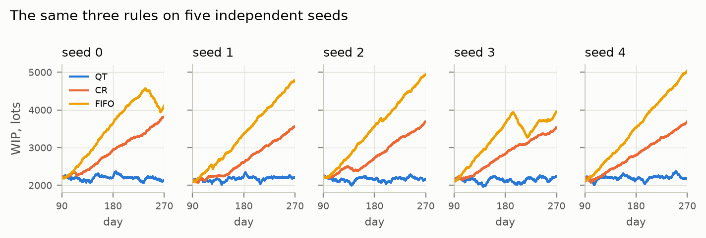
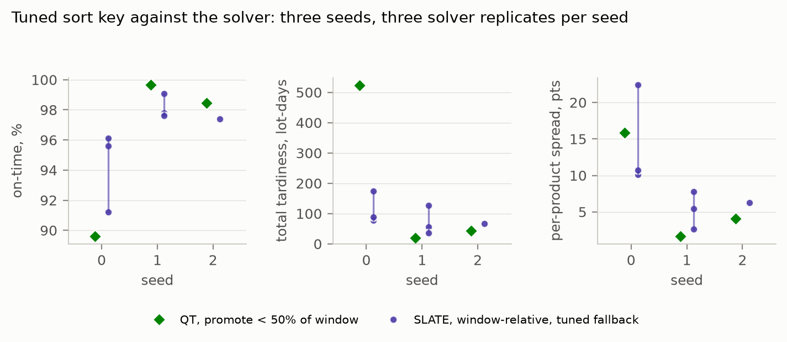
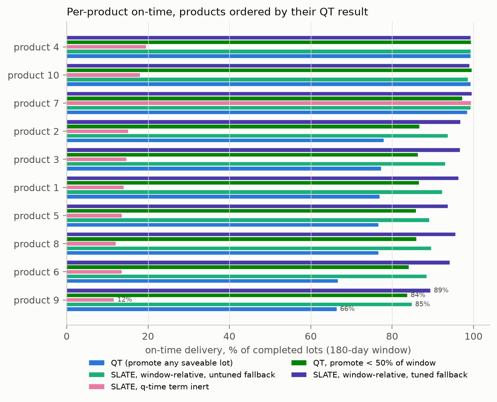
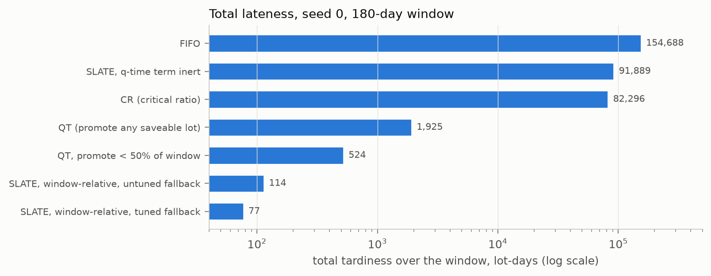
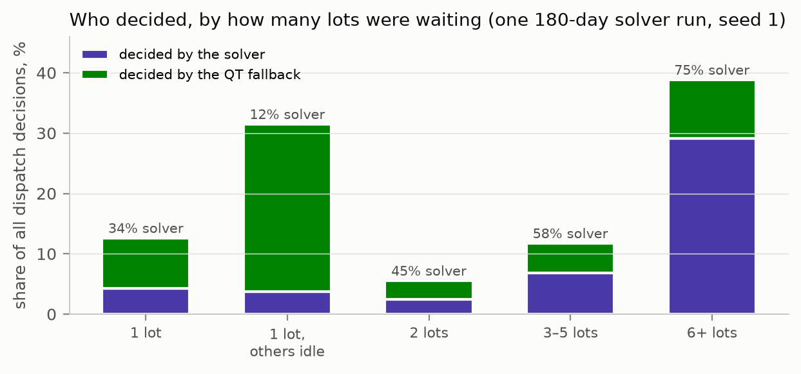
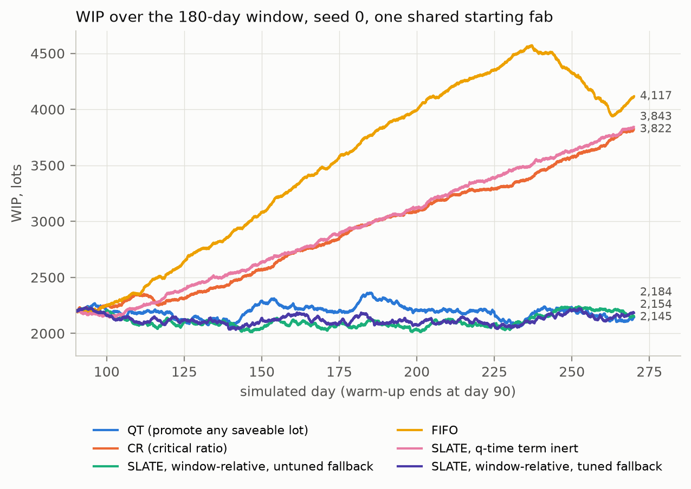
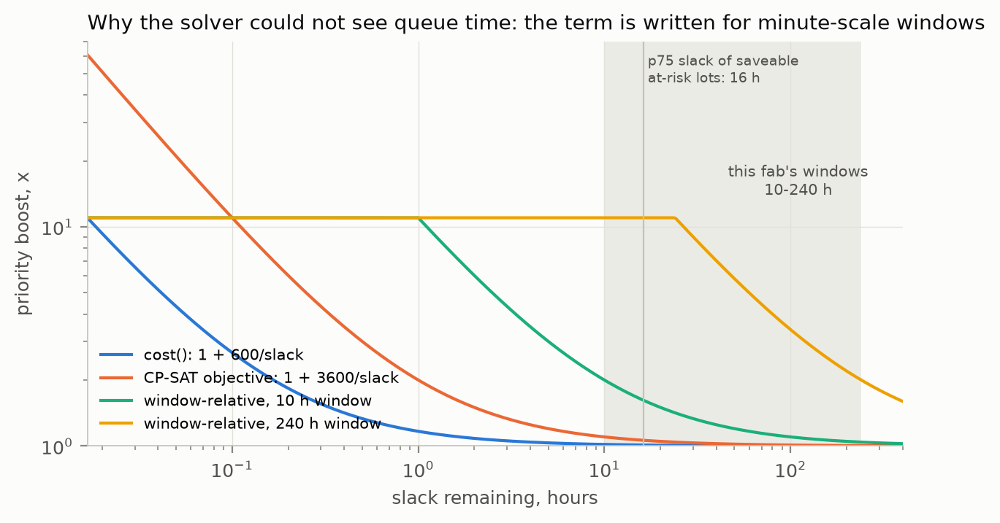
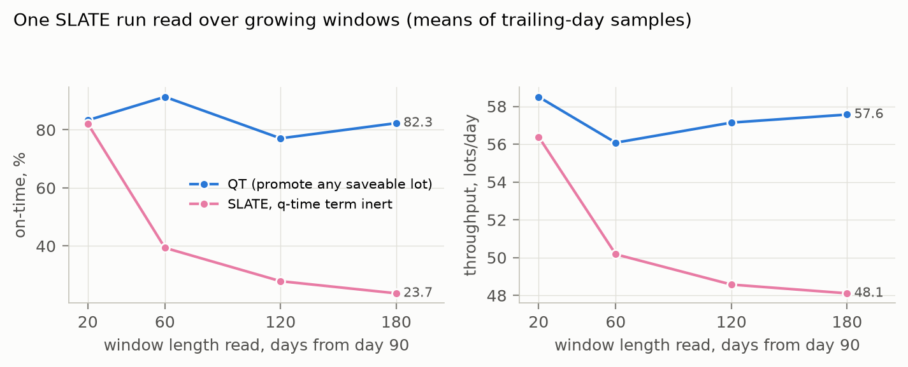

# When Does an Assignment Solver Beat a Sort Key? Dispatching Under Queue-Time Constraints in a Simulated 300 mm Wafer Fab

<div class="meta" markdown="1">
**Alton Alexander** · Front Analytics · alton@frontanalytics.com<br>
Draft for review, September 2026 · Code and data: <https://github.com/altonalexander/fab-optimization> (this document built at commit `a4eac76`)
</div>

<div class="abstract" markdown="1">
**Abstract.** Every time a machine in a wafer fab frees up, a dispatching decision picks the next lot. Almost all production fabs make that decision with a sort key — a priority rule that ranks the waiting lots one at a time. The alternative is to solve an assignment across all waiting lots and all free tools at once. This paper asks a narrow question: on a realistic simulated fab, does the assignment formulation beat the best sort key we could build, and by how much? We use the public SMT2020 low-volume/high-mix testbed inside the PySCFabSim discrete-event simulator, add enforcement of the queue-time windows the dataset already carries (with rework on violation and scrap after repeated failure), and compare FIFO, critical ratio, a queue-time-aware sort key we call QT, and a per-family CP-SAT assignment solver, every policy resumed from one shared warmed checkpoint over 180 simulated days at full load. Three results. First, the sort key decides whether the fab is *viable*, not merely how efficient it is: on five independent seeds QT holds work-in-process stationary with zero scrap, while FIFO and critical ratio diverge on the same fab at a consistent +8 to +16 lots/day. Second, against the tuned QT, the solver's advantage depends on how hard the seed's drawn history is. On the hard seed, where the tuned rule reaches 89.6 % on-time, all three solver replicates beat it — by +1.6 to +6.5 on-time points and 3 to 7× less total tardiness — at identical throughput and zero scrap. On an easy seed, where the rule is at 99.65 %, the solver lands 0.6 to 2.0 points below it on every replicate. Third, the solver's 46 % share of dispatch decisions understates its role: 44 % of all decisions have exactly one candidate lot, and among the decisions with a choice the solver makes 69 %, rising to 75 % when six or more lots wait. The solver costs 3 to 7× the wall clock of the rule. We also report a calibration failure that inverted an earlier replicated verdict, a deviation in our queue-time window definition that makes every window stricter than the dataset specifies, and the measurement controls that caught both.
</div>

## 1. Introduction

A 300 mm wafer fab runs a few hundred product routes of several hundred steps each through roughly a thousand tools grouped into families of interchangeable machines. Routes are re-entrant: the same lot returns to the same lithography, etch and diffusion families dozens of times, so the queue a lot joins depends on every dispatching decision made before it. Tools break down, need preventive maintenance, carry recipe-dependent setups, and in the furnace families process batches that must be filled. Whenever a tool frees, something has to decide which of the waiting lots it takes. That decision — the *dispatching rule* — is made tens of thousands of times a day.

Production fabs make it with a sort key. Each lot in the family's queue is scored by a tuple (a hot-lot flag, a setup match, an age, a ratio of time-to-due-date over remaining work) and the tool takes the top of the sort. FIFO and critical ratio (CR) are the canonical instances; the survey literature on job-shop dispatching rules is large and old [1,2], and the semiconductor-specific reviews [3,4] describe the same family of policies under the constraints particular to wafer fabrication.

The alternative treats the decision as an *assignment*: at each moment, choose which lot runs on which free tool across a whole family (or the whole fab) so as to minimise a cost, subject to capacity, batch and resource constraints. Constraint programming solvers such as CP-SAT [5] make such models tractable at the sub-second timescale a dispatcher needs. The intuition for why assignment should win is that a sort key can only *rank*: it cannot express "these two lots should share a furnace batch," "this lot should wait because the tool it is on is the only one that can run the lot behind it," or "give this product a little less service because that one is about to miss." An assignment over a set can.

The question this paper asks is deliberately narrow. Not "is scheduling useful" — a sort key is already a scheduler — but: **on a realistic fab, does solving an assignment at the dispatch moment beat ranking, and by how much, against the best sort key we can construct?** The question is hard to answer in a real fab because the demand, the breakdowns and the tool set are never the same twice, so a policy that looks better this quarter may have had an easier quarter. A simulator on a public testbed removes that confound: every policy runs on identical demand, identical breakdowns and an identical starting fab, so the only thing differing between two rows of a results table is the decision.

We make five contributions.

1. **Queue-time enforcement on SMT2020.** The dataset ships queue-time windows on 264 route steps; the simulator parses and ignores them. We enforce them — a lot that misses its window is reworked from the step that opened it, and a lot that misses too often is scrapped — which gives the fab a way to *lose* work rather than merely be slow (§3.3).
2. **The finding that the sort key decides viability.** With queue times enforced, a queue-time-aware sort key holds the fab stationary at full load with zero scrap; FIFO and CR diverge on the same fab. Replicated on five seeds (§6.1).
3. **A paired, replicated comparison of a minimum viable assignment solver against the tuned sort key**, on three seeds with three solver replicates on two of them, which shows the solver's advantage is a function of how stressed the fab's drawn history is (§6.2–6.4).
4. **A decomposition of what the solver actually decides**: which dispatch decisions have a choice at all, and of those, which the solver made rather than its fallback rule (§6.6).
5. **A reproducible testbed**, in which every number in this document is generated from result files in the repository, and the sequence of decisions is recorded in architecture decision records that preserve the falsified verdicts rather than tidying them [6].

## 2. The testbed

### 2.1 Dataset

SMT2020 [7] is a public semiconductor manufacturing testbed with four scenarios. We use the low-volume/high-mix (LVHM) scenario throughout. Read into the simulator it presents:

- **10 products**, with routes of 242 to 583 steps;
- **1,313 tools**, of which **913** are process tools in **105 families** (median family size 5, the largest 118) and **400** are `Delay` pseudo-tools that model fixed waits rather than capacity;
- an initial work-in-process of **2,164 lots**, and a release schedule (`order.txt`) that the simulator follows verbatim at **≈56.6 lots/day**;
- **264 distinct steps carrying a queue-time window**, with nine distinct window lengths between **1 and 24 hours**;
- batch (furnace) steps on 9–19 steps per route, and setup-bearing steps on 27–58 per route.

| product | route steps | steps with a q-time window | batch steps | setup-bearing steps |
| --- | ---: | ---: | ---: | ---: |
| product 1 | 521 | 29 | 15 | 48 |
| product 2 | 529 | 38 | 19 | 54 |
| product 3 | 583 | 41 | 17 | 58 |
| product 4 | 343 | 25 | 11 | 35 |
| product 5 | 242 | 11 | 9 | 27 |
| product 6 | 293 | 27 | 12 | 30 |
| product 7 | 353 | 24 | 12 | 36 |
| product 8 | 375 | 20 | 12 | 40 |
| product 9 | 384 | 23 | 13 | 34 |
| product 10 | 390 | 26 | 15 | 39 |

*Table 1. Route structure of the ten LVHM products as loaded by the simulator. Queue-time steps are the ones on which a window opens.*

### 2.2 Simulator

PySCFabSim [8] is an open discrete-event simulator built for this testbed. It models re-entrant routes with the route's own rework, setup matrices with minimum-run-length rules, batching (we use its `Demand` batch strategy), time- and piece-based preventive maintenance, random breakdowns and repair, and due dates per lot. We vendor it unchanged at a pinned upstream commit and make our additions in a small number of clearly marked places; a document in the repository lists every divergence.

The simulator simplifies in ways that matter for the reading of any result [9]:

- **Transport time is zero** in this configuration. Nothing moves between tools; a lot is available at its next family the instant it finishes. (This is why a reticle-exclusivity constraint we tested earlier never bound — a mask move is free.)
- **Delay steps are a pseudo-toolset** of 400 stations rather than a modelled wait.
- **There is no storage or stocker capacity.**
- **Queue-time constraints are parsed and ignored** upstream. This is the gap §3.3 closes.

**What a seed is.** Nothing about the fab, the product mix, the release schedule or the policies changes between seeds. A seed selects one random stream, and that stream draws the tool breakdown and repair times (exponential and uniform, per tool, over the whole run), the processing-time variation on steps that carry a spread, whether a lot takes an optional sampling or process-rework step, and the tie-breaks in the dispatcher. Two seeds are therefore two different 270-day histories of the same fab, and the 90-day warm-up leaves each in a different state: the same number of lots, but stuck behind different down tools with different queue-time exposure. §6.3 shows this matters more than we expected.

### 2.3 What is and is not in play

Two constraint overlays built earlier in this project — tool qualification (dedication) and reticle exclusivity — are **off** in every experiment here. Both were tested and neither separated the rules: qualification only filters which tools a lot may use, which a sort key handles; reticles never bind on this fab because there are enough masks and moving one costs nothing. The tool set is the dataset's full complement; an earlier attempt to trim it showed the fab has about 5 % of slack, so capacity is a cliff rather than a dial.

What is in play, in every run: re-entrant routes, the route's own rework, setups with minimum runs, batching, PM, breakdowns, due dates, family qualification (a step runs only on its own family), and — added here — queue-time windows with rework and scrap.

## 3. Method

### 3.1 Warm-up, checkpoints and the A/B

A discrete-event simulator cannot start at day 90; it must simulate there. We warm the fab for 90 simulated days under one rule, checkpoint the entire simulator state — event queue, tool setups, pending breakdowns, RNG — and resume **every** policy from that identical checkpoint. The rows of a results table therefore differ in nothing but the dispatching decision, which is the only reason the table means anything. The checkpoint is keyed by every setting that changes the trajectory (dataset, seed, warm-up rule, batch strategy, day, and every constraint in force), so a fab warmed under one constraint can never be silently resumed under another.

Measurement runs for a further **180 days** (days 90–270). KPIs are computed over lots that *completed* in the window: throughput, cycle time, on-time delivery, total tardiness in lot-days, tool utilisation, and — from the additions below — violations, reworks and scrapped lots. All are reported per product as well as fab-wide, because a fab-wide average hid three effects during this work before we stopped trusting it.

### 3.2 Admissibility before interpretation

A diverging fab produces numbers that describe where the window was cut, not the policy. Every cell is therefore gated before it is read:

1. **Conservation.** Over the window, `releases = good lots out + scrapped + ΔWIP`. The release schedule is fixed, so this must reproduce ≈56.6 lots/day (57.2 in every warmed run reported here). This identity caught a reporting error in which queue-time counters were accumulated from day 0 while throughput was window-scoped, implying 8,325 lots left a fab that had started 5,100.
2. **Stationarity.** The WIP slope over the final third of the window, in lots/day. A cell that is still climbing is reported as diverging and its other numbers are not interpreted.
3. **Not stationary by loss.** Scrap destroys material, so a fab can hold WIP flat *because* it is eating itself. A cell losing more than a fifth of its releases is not a fab anyone would run, however steady its WIP.

### 3.3 Queue-time enforcement, rework and scrap

A queue-time window is a limit on how long a lot may wait between two specific steps — typically after a clean or a bake — before the work is damaged. SMT2020 carries these limits on 264 steps; PySCFabSim reads them into `Step.cqt_for_step` and `Step.cqt_time` and does nothing with them.

SMT2020 defines the window from the **completion** of the opening step to the **start** of the closing step. Our implementation checks the closing side correctly but opens the window when the opening step **starts** processing, so the opening step's own setup and processing time are counted against the window. This is a deviation from the dataset's definition and makes every window **stricter** than specified; §7.3 sizes it and states what it does and does not affect. A window length is `cqt_time × s`, where `s` is a scale we sweep; the results here use **s = 10**, so windows are 10–240 hours. On violation the lot is **reworked**: its processed steps are rolled back to the opening step and it redoes that work. The route's own rework is modelled identically and reuses the mechanism.

The first version reworked without limit, and it turned the fab into an absorbing state: over 30 cold days at s = 8, 422 violations fell on twelve lots, six of which were reworked twenty or more times and one 83 times, concentrated on six step orders. Those lots never left; WIP climbed while fab-wide utilisation *fell* to 30 %, because trapped work on a handful of steps starved the rest. That is not a fab, it is a missing termination rule. A real fab scraps material that has failed too often, and the scrap is precisely the loss this constraint class is supposed to introduce. We therefore **scrap** a lot after its third rework (`cqt_max_rework = 3`): it leaves the active set and is deliberately *not* counted as a completion, so it reduces throughput and never inflates on-time.

Three controls establish that the machinery has no side effects of its own:

| arm (40 cold days, seed 0) | lots out | util % | violations | reworks | scrapped | end WIP |
| --- | ---: | ---: | ---: | ---: | ---: | ---: |
| no enforcement | 2380 | 81.9 | 0 | 0 | None | 2,054 |
| scale 8, detection only | 2380 | 81.9 | 300 | 0 | None | 2,054 |
| scale 8, rework, uncapped | 1932 | 81.6 | 734 | 733 | None | 2,502 |
| scale 4, rework, uncapped | 700 | 44.4 | 14518 | 14509 | None | 3,734 |
| scale 4, rework, cap 3 | 1612 | 61.8 | 5216 | 4453 | 752 | 2,070 |

*Table 2. Mechanism checks over 40 cold days from an empty fab, seed 0. Detection-only is digit-identical to no enforcement on every field. Uncapped rework at scale 4 collapses utilisation; the cap recovers it and converts the trapped work into scrap.*

### 3.4 Determinism, and the noise floor of solver runs

The sort keys are bit-deterministic: two independent runs of the tuned QT on seed 0 produce the same result to the last digit and the same fingerprint over the full 180-day window (Table 3). One run per sort key per seed is therefore the complete measurement, and every difference between two sort-key rows is signal.

| run | good/day | on-time | tardiness | fingerprint |
| --- | ---: | ---: | ---: | ---: |
| QT tuned, seed 0 | 57.4 | 89.60% | 524 | `f39ba74ce011049e` |
| QT tuned, seed 0, repeat | 57.4 | 89.60% | 524 | `f39ba74ce011049e` |
| identical? |  |  |  | **yes** |

*Table 3. Two independent runs of the tuned sort key on seed 0. The fingerprint is a hash of the complete per-lot outcome.*

The solver is not. CP-SAT is configured with a fixed random seed, but its per-solve budget is a **wall-clock** limit (5 ms per family), so how much search completes depends on machine load. Four identical serial solver runs on a 3-day probe returned 169, 169, 176 and 181 lots. Over 180 days the spread is material: the three replicates on seed 0 span 4.9 on-time points and a factor of 2.3 in tardiness (§6.4). A single solver row against a single rule row cannot be read, so every solver result below is replicated and reported as a range, and the paired comparison asks whether the solver is better on *every* replicate rather than on average. The deterministic-time budget OR-Tools offers would fix this and is left as future work because changing it mid-experiment would shift the effective budget.

## 4. Dispatching policies

Every policy is consulted at the same point: a tool has freed, and the simulator asks for a priority tuple per waiting lot in that tool's family, then takes the minimum. The upstream tuples all begin with a minimum-run-length flag and the setup time a lot would incur on this tool, so setup avoidance is common to every rule.

### 4.1 FIFO and critical ratio

`fifo` orders by hot-lot priority, then release time. `cr` orders by priority, then the critical ratio `(due − now) / remaining processing`. Neither is aware that queue-time windows exist, and — since the windows are hours while due dates are days — neither will prioritise a lot two hours from lapsing over one that is merely old.

### 4.2 QT: a queue-time-aware sort key

`qt` is `cr` with one tier inserted ahead of setup: a lot with an **open, still-achievable** queue-time window outranks every lot without one, ordered among themselves by slack. Everything else is exactly `cr`, so `qt − cr` isolates the value of protecting windows and nothing else. Upstream had written this tier into all five of its rules and left it commented out (`#0 if lot.cqt_waiting is not None else 1`) — reasonably, since it had nothing to act on — but theirs is binary and ours orders by slack.

Two details of the rule are results in their own right.

**Lapsed lots must not be promoted.** The first version ordered by slack alone, which puts the *most hopelessly late* lots at the front of every queue. On a warmed fab that is most of them: of 3,095 active lots, 978 held an open window and 650 of those (66.5 %) were already past their deadline, with median slack −67 h and the worst −262 h. A window that has lapsed cannot be un-lapsed, so promoting such a lot spends capacity on work already guaranteed to rework or scrap. The bug was invisible on a cold fab (few lots lapse in twelve days) and catastrophic on a warmed one (throughput down 55 %). Fixed, only lots with positive slack are promoted; a lapsed lot takes its turn by `cr`.

**Promotion should be selective.** Promoting *any* saveable at-risk lot, whether it has twenty minutes or two hundred hours left, is indiscriminate and disrupts setup and batch grouping for lots that were never in danger. The **tuned QT** promotes only when `slack < 0.5 × window`; a threshold of a quarter was also tried and was slightly worse. The untuned rule (`f = 1.0`) remains the default and is what the fab is warmed under, so that every seed's starting fab is produced the same way.

### 4.3 SLATE: a per-family CP-SAT assignment

The solver is the project's original object. Its model is a single-period assignment: one Boolean per feasible (lot, tool) pair, at-most-one tool per lot, tool capacity, batch-furnace firing bounds, and reticle exclusivity. There is **no time index**: it assigns, it does not sequence, on the argument that re-solving every 60 simulated seconds makes the present the only moment that matters. The objective minimises

```
cost(lot, tool) = (setup_s + process_s) / (urgency × qtime_boost)
```

where `urgency` collapses everything Python knows into one scalar — a piecewise critical-ratio curve (gentle above CR = 1, steep below it, capped at 50×), an ageing term, and a downstream-congestion term that discounts pulling a lot into an already-congested next family — and `qtime_boost` is a function of the lot's remaining queue-time slack **expressed as a fraction of its window**. That last clause is the one-line calibration fix that §8 describes; the solver as shipped used raw slack in seconds, which on this fab's windows made the term arithmetically absent.

Three engineering properties matter for reading the results:

- **Decomposition.** The eligibility matrix is block-diagonal — a step runs only on its family — so the fab-wide problem is solved as ~105 independent per-family problems of ~25 lots × ~12 tools each, with lazy invalidation so only families whose state moved are re-solved. This is what makes ~240,000 rebuilds per 180 days tractable at all.
- **Coverage.** The solver plans on a 60-second cycle; a lot the current slate has no token for is dispatched by a **fallback** rule. Raw coverage — the share of all decisions the solver made — is 45–46 % in every solver run here. That figure is misleading in a way §6.6 unpacks: a large fraction of dispatch decisions have exactly one candidate lot and nothing to decide. The fallback used throughout is the **tuned QT**, so the solver contains the baseline it is compared against (§7.4).
- **Parallelism.** The per-family solves were serial; we made them concurrent (one backend instance per worker, results merged in a fixed order), for a measured **2.9×** on a 3-day probe. Accepted on statistical equivalence per §3.4.

## 5. Experimental design

**Operating point.** 1.00× the dataset's release schedule; queue-time scale 10; rework on; scrap after three failures; the full tool set; no qualification or reticle overlay. The warm-up rule is the untuned `qt` (so the starting fab is one a viable rule would actually produce), and every row on a seed resumes that seed's checkpoint.

**Seeds and replicates.** Sort keys (`fifo`, `cr`, `qt`, tuned `qt`): one run each on seeds 0–4, which by §3.4 is complete. Solver, with the tuned `qt` fallback: three replicates on seeds 0 and 1, one on seed 2. The seeds were chosen by number before any result existed; §6.3 shows, after the fact, which of them were hard.

**Pre-registered bar.** Before the solver was run against `qt` we fixed what "winning" would mean: (i) keep scrap at zero and WIP stationary; (ii) hold good lots/day within run-to-run noise of `qt`'s; (iii) close some of the per-product on-time spread. Landing on `qt`'s numbers would mean a sort key with extra steps at several times the compute.

**Symmetry.** The fallback inside the solver is the same tuned rule the solver is measured against. An earlier round compared a solver carrying the untuned fallback against the tuned rule and overstated the solver's margin; every solver row here is symmetric.

**Progress instrumentation.** A 180-day solver run takes hours and, until we added it, printed nothing until it wrote its result. Every run here reports WIP, throughput rate, scrap and solver coverage every ten simulated days, which is what allowed a failing configuration to be recognised at minute ten rather than hour four.

## 6. Results

### 6.1 The sort key decides whether the fab is viable

| seed | rule | good/day | on-time | CT (d) | tardiness | scrap/day | viol/day | WIP | slope, final ⅓ |
| --- | ---: | ---: | ---: | ---: | ---: | ---: | ---: | ---: | ---: |
| 0 | FIFO | 40.2 | 22.53% | 59.4 | 154,688 | 6.3 | 60.0 | 2,199→4,117 | -0.95 |
| 0 | CR | 44.4 | 15.16% | 48.9 | 82,296 | 3.8 | 88.6 | 2,199→3,822 | +10.38 |
| 0 | QT | 57.5 | 81.66% | 38.4 | 1,925 | 0.0 | 1.4 | 2,199→2,145 | -1.13 |
| 0 | QT tuned | 57.4 | 89.60% | 38.3 | 524 | 0.0 | 1.1 | 2,199→2,166 | +1.17 |
| 1 | FIFO | 41.8 | 24.65% | 56.1 | 136,573 | 0.8 | 32.9 | 2,130→4,766 | +15.40 |
| 1 | CR | 46.6 | 34.01% | 45.1 | 56,288 | 2.6 | 74.1 | 2,130→3,567 | +10.51 |
| 1 | QT | 56.8 | 92.70% | 38.0 | 590 | 0.0 | 1.1 | 2,130→2,207 | +2.08 |
| 1 | QT tuned | 57.2 | 99.65% | 37.1 | 20 | 0.0 | 1.0 | 2,130→2,124 | +1.28 |
| 2 | FIFO | 41.5 | 22.44% | 58.1 | 150,370 | 0.7 | 33.4 | 2,239→4,934 | +15.93 |
| 2 | CR | 46.1 | 22.85% | 47.1 | 72,154 | 3.0 | 72.8 | 2,239→3,695 | +10.17 |
| 2 | QT | 57.6 | 93.95% | 37.8 | 353 | 0.0 | 1.3 | 2,239→2,164 | +0.57 |
| 2 | QT tuned | 57.5 | 98.47% | 37.4 | 42 | 0.0 | 0.9 | 2,239→2,185 | +1.70 |
| 3 | FIFO | 40.8 | 18.42% | 60.8 | 164,408 | 6.2 | 56.5 | 2,123→3,960 | +7.15 |
| 3 | CR | 46.9 | 30.68% | 47.1 | 73,606 | 2.4 | 62.2 | 2,124→3,537 | +7.82 |
| 3 | QT | 56.6 | 95.51% | 37.4 | 212 | 0.0 | 1.1 | 2,124→2,231 | +2.82 |
| 3 | QT tuned | 57.1 | 96.99% | 38.1 | 97 | 0.0 | 1.2 | 2,124→2,136 | +0.73 |
| 4 | FIFO | 40.8 | 23.55% | 57.6 | 144,498 | 0.0 | 28.9 | 2,096→5,041 | +16.48 |
| 4 | CR | 47.6 | 19.48% | 48.6 | 85,816 | 0.6 | 74.1 | 2,096→3,698 | +9.82 |
| 4 | QT | 56.8 | 85.27% | 38.4 | 1,614 | 0.0 | 1.1 | 2,096→2,163 | -1.08 |
| 4 | QT tuned | 57.3 | 95.51% | 37.5 | 401 | 0.0 | 1.0 | 2,096→2,075 | +0.03 |

*Table 4. Four sort keys on five seeds, each quartet resumed from its own `qt`-warmed checkpoint at full load. Slope is WIP lots/day over the final third of the 180-day window. Every row is a single deterministic run.*

<figure>

<figcaption><b>Figure 1.</b> Work-in-process over the measurement window for the three untuned sort keys on five independent seeds. QT holds WIP at its starting level on every seed; CR climbs at +8 to +10 lots/day; FIFO climbs faster and on two seeds saturates at a high level by scrapping.</figcaption>
</figure>

With queue-time windows enforced, `qt` holds WIP stationary on all five seeds (final-third slopes between −1.1 and +2.8 lots/day), scraps nothing, holds violations near one a day, and delivers 82–96 % on-time untuned and 90–99.7 % tuned. On the same fab, same demand and same machines, `cr` diverges at +7.8 to +10.5 lots/day on every seed, and `fifo` diverges on all five, on two of them saturating at a high WIP by scrapping over six lots a day. Total tardiness differs by factors of 40 to 800.

This is the larger result of the paper and it was not the one we set out to find. The dispatching rule is usually discussed as a matter of efficiency — a few percent of cycle time or on-time. Here it is a matter of **stability**: the mechanism is that a missed window reworks the lot, the rework competes with fresh work, more windows are missed, and the backlog compounds. `cr` and `fifo` never break the loop because neither can see a window; `qt` breaks it by spending capacity only where it still buys something. We had initially read the divergence as a capacity limit — "rework is demand this fab has no slack to absorb" — and that reading was wrong: `cr` diverges at +10 lots/day on the same tools that `qt` holds flat.

### 6.2 The solver against the tuned sort key

| seed | metric | QT tuned | SLATE (mean, min–max) | SLATE − QT (mean, range) | better on every replicate |
| --- | --- | ---: | ---: | ---: | --- |
| 0 (n=3) | on-time % | 89.60 | 94.31 (91.21–96.10) | +4.71 (+1.61–+6.50) | solver |
|  | tardiness | 524 | 113 (77–174) | -410.6 (-446.7–-350.0) | solver |
|  | good/day | 57.4 | 57.6 (57.3–57.9) | +0.2 (-0.1–+0.5) | mixed |
|  | CT (d) | 38.3 | 37.2 (37.1–37.2) | -1.1 (-1.2–-1.0) | solver |
|  | per-product spread | 15.8 | 14.4 (10.1–22.4) | -1.4 (-5.7–+6.5) | mixed |
| 1 (n=3) | on-time % | 99.65 | 98.16 (97.62–99.08) | -1.49 (-2.03–-0.57) | rule |
|  | tardiness | 20 | 73 (36–127) | +53.5 (+15.9–+107.6) | rule |
|  | good/day | 57.2 | 57.0 (56.7–57.2) | -0.2 (-0.5–-0.0) | rule |
|  | CT (d) | 37.1 | 36.7 (36.5–36.9) | -0.4 (-0.5–-0.1) | solver |
|  | per-product spread | 1.7 | 5.3 (2.6–7.8) | +3.6 (+1.0–+6.1) | rule |
| 2 (n=1) | on-time % | 98.47 | 97.41 | -1.06 | rule (n=1) |
|  | tardiness | 42 | 67 | +24.5 | rule (n=1) |
|  | good/day | 57.5 | 57.8 | +0.3 | solver (n=1) |
|  | CT (d) | 37.4 | 37.0 | -0.4 | solver (n=1) |
|  | per-product spread | 4.1 | 6.3 | +2.2 | rule (n=1) |

*Table 5. The paired comparison on each seed: the tuned QT (one deterministic run) against the symmetric solver (three replicates on seeds 0 and 1, one on seed 2). The last column asks whether the solver is better on every replicate; "mixed" means the replicates straddle the rule.*

<figure>

<figcaption><b>Figure 2.</b> The tuned sort key (diamonds) against every solver replicate (dots, with the replicate range as a bar) on three seeds. On seed 0 every replicate is above the rule on on-time and below it on tardiness; on seed 1 every replicate is the other way; seed 2 has one replicate.</figcaption>
</figure>

On **seed 0**, every solver replicate beats the tuned rule on on-time delivery (+1.6, +6.0 and +6.5 points), on total tardiness (77, 89 and 174 lot-days against 524), and on cycle time (1.1 days shorter), at the same throughput, the same violation rate, zero scrap and stationary WIP. The pre-registered bar is met on (i) and (ii). On (iii), the per-product spread, two replicates narrow it from 15.8 to about 10 points and one widens it to 22.4, so that claim is mixed.

On **seed 1**, every solver replicate is *below* the tuned rule on on-time (−0.6, −1.9 and −2.0 points) and above it on tardiness (36, 57 and 127 lot-days against 20), with a slightly wider per-product spread; cycle time is still shorter. On **seed 2**, the single replicate is 1.1 points below the rule with tardiness of 67 against 42. Throughput, violations, scrap and stationarity are indistinguishable on every seed.

So the answer to the paper's question is not a single number. The solver is better on the seed where the rule has the most left to give, and slightly worse where the rule is already within a point or two of the ceiling.

### 6.3 The seeds are not equally hard, and it was knowable in advance

| seed | WIP at day 90 | QT on-time | QT tardiness | QT tuned on-time | QT tuned tardiness | SLATE on-time | SLATE − QT tuned |
| --- | ---: | ---: | ---: | ---: | ---: | ---: | ---: |
| 0 | 2,199 | 81.66% | 1,925 | 89.60% | 524 | 94.31% (91.21%–96.10%) (n=3) | +4.71 |
| 1 | 2,130 | 92.70% | 590 | 99.65% | 20 | 98.16% (97.62%–99.08%) (n=3) | -1.49 |
| 2 | 2,239 | 93.95% | 353 | 98.47% | 42 | 97.41% (n=1) | -1.06 |
| 3 | 2,124 | 95.51% | 212 | 96.99% | 97 | not run | — |
| 4 | 2,096 | 85.27% | 1,614 | 95.51% | 401 | not run | — |

*Table 6. Every seed, ordered by number, with the on-time delivery each rule reached and the solver's mean. WIP at day 90 does not predict difficulty; the untuned rule's result does.*

The five seeds are draws of the same fab, and they are not equally stressed. Under the untuned rule, on-time delivery ranges from 81.7 % (seed 0) to 95.5 % (seed 3), with tardiness from 212 to 1,925 lot-days — a nine-fold range on identical demand, produced by where the breakdown draws happened to fall. WIP at day 90 is within 7 % across seeds and does not predict it; it is not a load story. Seeds 0 and 4 are the hard draws; seeds 1, 2 and 3 are easy, and on the easy ones the tuned rule reaches 97–99.7 %.

Two things follow. First, the solver's advantage in Table 5 is a function of this difficulty: +4.7 points on average where the rule sits at 89.6 %, −1.5 where it sits at 99.65 %. There is little to gain on an easy draw, and the solver's own run-to-run noise (§3.4) is then larger than the room available. Second, the untuned rule's on-time — a quantity available before any solver run — ranks the seeds by difficulty. We chose seeds 0, 1 and 2 for the solver by number, before this table existed, and so replicated the solver on one hard seed and two easy ones while the second hard seed (4) has no solver runs. That is the most direct next experiment (§9).

### 6.4 The replicates themselves

| seed | run | good/day | on-time | CT (d) | tardiness | viol/day | scrap/day | spread | slope | wall (s) |
| --- | ---: | ---: | ---: | ---: | ---: | ---: | ---: | ---: | ---: | ---: |
| 0 | QT tuned | 57.4 | 89.60% | 38.3 | 524 | 1.1 | 0.0 | 15.8 | +1.17 | 3,067 |
|  | SLATE a | 57.3 | 96.10% | 37.2 | 77 | 1.6 | 0.0 | 10.1 | +1.23 | 14,617 |
|  | SLATE b | 57.9 | 91.21% | 37.2 | 174 | 1.8 | 0.0 | 22.4 | -1.45 | 22,348 |
|  | SLATE c | 57.6 | 95.61% | 37.1 | 89 | 1.6 | 0.0 | 10.7 | +1.25 | 22,265 |
| 1 | QT tuned | 57.2 | 99.65% | 37.1 | 20 | 1.0 | 0.0 | 1.7 | +1.28 | 7,044 |
|  | SLATE a | 56.7 | 97.79% | 36.9 | 127 | 1.8 | 0.0 | 5.5 | +1.03 | 22,174 |
|  | SLATE b | 57.2 | 97.62% | 36.6 | 57 | 1.1 | 0.0 | 7.8 | +0.20 | 22,174 |
|  | SLATE c | 57.1 | 99.08% | 36.5 | 36 | 1.4 | 0.0 | 2.6 | +1.57 | 18,801 |
| 2 | QT tuned | 57.5 | 98.47% | 37.4 | 42 | 0.9 | 0.0 | 4.1 | +1.70 | 6,986 |
|  | SLATE b | 57.8 | 97.41% | 37.0 | 67 | 1.4 | 0.0 | 6.3 | +1.07 | 18,937 |

*Table 7. Every solver replicate alongside its seed's tuned rule. Wall clock is for the 180 measured days on 16 cores; solver rows use 8-way family parallelism, and the rows were run four at a time so their wall clocks are not comparable with each other.*

The replicate spread is the honest error bar on everything the solver is credited with. On seed 0 the three replicates span 91.2–96.1 % on-time and 77–174 lot-days of tardiness; replicate b is the outlier on both and is the one that widens the per-product spread. On seed 1 the span is 97.6–99.1 %. The spread is a property of the wall-clock solve budget, not of the fab (the sort keys on the same seeds are bit-identical), and is the reason a single solver run should never be reported against a single rule run.

### 6.5 Per-product results on the hard seed

| product | QT | QT tuned | SLATE inert | SLATE fixed (a) | SLATE fixed (b) | SLATE sym |
| --- | ---: | ---: | ---: | ---: | ---: | ---: |
| product 9 | 66.41% | 83.77% | 11.67% | 84.88% | 83.27% | 89.47% |
| product 6 | 66.73% | 84.14% | 13.64% | 88.57% | 87.36% | 94.19% |
| product 8 | 76.69% | 86.07% | 12.14% | 89.67% | 90.12% | 95.64% |
| product 5 | 76.74% | 85.89% | 13.58% | 89.16% | 90.87% | 93.77% |
| product 1 | 76.97% | 86.64% | 14.10% | 92.34% | 92.86% | 96.41% |
| product 3 | 77.38% | 86.38% | 14.75% | 93.15% | 92.62% | 96.72% |
| product 2 | 78.03% | 86.74% | 15.24% | 93.80% | 95.29% | 96.81% |
| product 7 | 98.55% | 97.29% | 99.43% | 99.32% | 99.61% | 99.61% |
| product 10 | 99.32% | 99.61% | 18.07% | 98.74% | 99.52% | 99.03% |
| product 4 | 99.33% | 99.42% | 19.62% | 99.32% | 98.75% | 99.32% |
| **spread (max − min)** | **32.9 pts** | **15.8 pts** | **87.8 pts** | **14.4 pts** | **16.3 pts** | **10.1 pts** |
| fab-wide | 81.66% | 89.60% | 24.91% | 92.89% | 93.02% | 96.10% |

*Table 8. On-time delivery per product on seed 0, products ordered by their result under the untuned rule. "SLATE fixed" is an earlier configuration that carried the untuned fallback (§8); "SLATE sym" is replicate a of the symmetric solver.*

<figure>

<figcaption><b>Figure 3.</b> Per-product on-time delivery on seed 0. The solver with its uncalibrated term (pink, §8) flattens every product but one to 12–20 %. The tuned <code>qt</code> (green) and the calibrated solver (aqua, violet) both lift the laggards without sacrificing the leaders.</figcaption>
</figure>

Two structural facts about the products explain why this is a due-date *allocation* problem. First, the lateness is marginal: under `qt`, late lots miss by 0.47 to 1.40 days on cycle times of 23–55 days — a 1–5 % overshoot. Second, it is not congestion: products 9 and 10 have identical cycle times (38.4 days) and are 33 points apart on on-time; product 4 is *slower* than product 6 and 33 points more punctual. The laggards are promised sooner relative to their routes, and the leaders have days of margin. Moving a fraction of a day of service from one to the other is the intended shape of the assignment formulation. Most of that movement is also reachable by the tuned rule's threshold: promoting only genuinely at-risk lots narrows the spread from 32.9 to 15.8 points on its own, which is why an earlier claim that *only* an assignment over a set could rebalance across products was withdrawn.

| product | route steps | q-time steps | QT CT | QT tard. | QT-tuned CT | QT-tuned tard. | SLATE-sym CT | SLATE-sym tard. |
| --- | ---: | ---: | ---: | ---: | ---: | ---: | ---: | ---: |
| product 9 | 384 | 23 | 38.4 | 162 | 38.2 | 47 | 37.6 | 4 |
| product 6 | 293 | 27 | 29.4 | 204 | 29.2 | 47 | 27.7 | 4 |
| product 8 | 375 | 20 | 36.8 | 305 | 36.5 | 83 | 35.9 | 8 |
| product 5 | 242 | 11 | 22.8 | 287 | 22.6 | 84 | 22.6 | 15 |
| product 1 | 521 | 29 | 48.5 | 283 | 48.3 | 77 | 47.4 | 12 |
| product 3 | 583 | 41 | 54.9 | 306 | 54.6 | 90 | 53.0 | 8 |
| product 2 | 529 | 38 | 51.1 | 319 | 50.8 | 81 | 48.8 | 11 |
| product 7 | 353 | 24 | 33.0 | 5 | 33.4 | 6 | 32.0 | 3 |
| product 10 | 390 | 26 | 38.4 | 33 | 38.5 | 2 | 37.5 | 9 |
| product 4 | 343 | 25 | 30.5 | 23 | 30.7 | 8 | 29.0 | 2 |

*Table 9. Per-product cycle time (days) and total tardiness (lot-days) on seed 0 for the untuned rule, the tuned rule, and solver replicate a, with route length and queue-time step count for context.*

<figure>

<figcaption><b>Figure 4.</b> Total tardiness over the window, seed 0, log scale, for every configuration we ran there. Three orders of magnitude separate the diverging rules from the viable ones.</figcaption>
</figure>

Tardiness is the metric on which the solver's advantage on the hard seed stayed widest after every correction to the baseline: it measures not only how many dates are missed but by how much, and the solver misses fewer and misses them by less. We do not have a mechanism for this beyond the observation that the objective's due-date curve is steep below CR = 1, so a lot that is going to be late is pushed hard.

### 6.6 What the solver actually decides

A solver run is a solver plus a fallback rule, and raw coverage — 46 % of decisions made by the solver — invites the reading that the rule does most of the work. It does not, because most dispatch decisions have nothing to decide.

| candidate set when the tool freed | decisions | share of all | share made by the solver |
| --- | ---: | ---: | ---: |
| exactly 1 lot | 486,613 | 12.6% | 33.7% |
| 1 lot, other tools in the family idle | 1,217,187 | 31.4% | 12.0% |
| 2 lots | 212,683 | 5.5% | 45.5% |
| 3–5 lots | 452,834 | 11.7% | 58.3% |
| 6 or more lots | 1,501,486 | 38.8% | 75.0% |
| **all decisions with a choice (≥ 2 lots)** | **2,167,003** | **56.0%** | **68.6%** |
| all decisions | 3,870,803 | 100% | 46.4% |

*Table 10. Every dispatch decision in one 180-day solver run (seed 1, replicate c), bucketed by how many lots were waiting for the tool that freed, and who made the decision. "Other tools idle" marks the case where a single lot waited and other tools in the family were already free, so any policy would have started it immediately.*

<figure>

<figcaption><b>Figure 5.</b> The same decomposition as Table 10. The solver's share rises with the size of the choice: 12 % where one lot waits and other tools are idle, 75 % where six or more lots wait.</figcaption>
</figure>

Forty-four per cent of all decisions have exactly one candidate lot, and in most of those other tools in the family were idle as well: every policy makes the same decision and it is immediate. Of the 56 % of decisions with a genuine choice, the solver makes **69 %**, and the share rises with the size of the choice — 45 % with two lots waiting, 58 % with three to five, **75 %** with six or more. The fallback's share is concentrated where the choice is small or absent. A 20-day probe on seed 0 gives the same effective coverage (69 %). The right description of a solver run is therefore that the solver makes about seven in ten of the decisions that matter, and nearly all of the contested ones, while the rule handles the rest.

### 6.7 Cost

A sort-key run of the 180-day window takes 3,100–7,000 s on this machine. A solver run takes 14,600–22,300 s with 8-way family parallelism, an average of about three cores busy — **3 to 7× the wall clock and on the order of 15× the CPU time**. Profiling attributes 60 % of a solver run to CP-SAT itself and 13 % to marshalling state across the Python/C++ boundary; the belief that the boundary was the bottleneck was true of an earlier version and had outlived the fix that made it false.

## 7. Threats to validity

### 7.1 Sample size

The rule result rests on five seeds of a deterministic policy and is the strongest thing here. The solver result rests on three seeds, with three replicates on two of them and one on the third. Seed 0's win and seed 1's loss are each supported by every replicate; seed 2 is a single run and is reported as such. The replicate spread on seed 0 (4.9 on-time points) is the error bar to hold in mind.

### 7.2 One fab, one scenario

Everything is LVHM. Tools within a family are identical; reticles never bind; transport is free. That is precisely the environment in which an assignment solver has least to offer, and nothing here speaks to the high-volume/low-mix scenario or to a fab with a binding coupling constraint.

### 7.3 The queue-time window is stricter than the dataset specifies

As §3.3 states, our window opens at the start of the opening step rather than at its completion, so the opening step's processing time is charged against it. Sized from the dataset (per-piece steps counted for a 25-wafer lot):

|  | native windows (scale 1) | as run (scale 10) |
| --- | ---: | ---: |
| window length, min / median / max (h) | 1 / 2 / 24 | 10 / 20 / 240 |
| entrance-step time ÷ window, median | 36% | 3.6% |
| mean | 39% | 3.9% |
| 90th percentile | 67% | 6.7% |
| worst of the 264 pairs | 181% | 18% |

*Table 11. The fraction of each queue-time window consumed by the opening step's own processing time, over the 264 window-carrying steps, at the dataset's native window lengths and at the scale we ran.*

At scale 10, the windows were on median about 4 % shorter than intended, and identically so for every policy. The paired comparisons stand, and every absolute number — violations, scrap, the tuned threshold — will move slightly in every policy's favour when the definition is corrected. The definition does bear on the operating point. At native scale the opening step alone consumes a third of a typical window and exceeds the whole window for the worst pair, so the native-scale infeasibility that led us to scale 10 was at least partly manufactured by this deviation. The correction is recorded as the first change after this batch and will require re-running every result in this paper; the robustness sweep over queue-time scale (§9) must re-establish the viable scale from the corrected window rather than assume 10.

### 7.4 Baseline containment

The solver is a solver *plus* a fallback, so it contains the baseline. Any comparison must tune both or neither; tuning one silently measures the handicap, and nothing in a result file records which version of the rule a solver row carried. Every solver row in §6 carries the same tuned rule it is compared against. It generalises to any hybrid policy with a rule underneath.

### 7.5 Unaudited coefficients

One constant, wrong by two orders of magnitude relative to the data, inverted a replicated conclusion (§8). The objective has several more — the critical-ratio curve's breakpoints and 50× cap, the ageing rate, the downstream-congestion weight — and none has been checked the same way. Until they are, the margins reported here are a property of *this* objective rather than of assignment as such.

## 8. A calibration failure, briefly

The solver's first two replicates against the untuned rule lost decisively: 48 good lots/day against 57.5, 25 % on-time against 82 %, tardiness of ~91,700 lot-days against 1,925, WIP diverging at +10 lots/day — a divergence signature nearly identical to `cr`'s. Two replicates agreed to 0.4 lots/day, and we wrote it up as the fourth constraint class on which the assignment formulation had lost. The cause was one constant. The queue-time boost was `1 + 600 / slack_seconds`, which is 11× at one minute of slack and 1.17× at one hour; on windows of 10–240 hours, the typical saveable at-risk lot had 16 hours of slack and received **1.01×**, against a due-date urgency reaching 50×. The solver had never, in effect, been told about queue time, and it behaved exactly like the rule that cannot see windows. The fix passes slack as a fraction of the window and changes nothing in the solver; with it, the same configuration matched the rule on every admissibility measure and beat it on lateness. The verdict was inverted by a one-line calibration, which is why every coefficient in §7.5 should be treated as unaudited until it is checked the same way: compute what value a typical lot actually receives and compare it with the scale of the competing terms. The tables and figures of that episode, and the short-window reading that would have hidden it, are in Appendix A.

## 9. Next steps

1. **Correct the window definition** (§7.3), then re-run every result here.
2. **A robustness sweep** over queue-time scale and release rate on the corrected window, to replace the single operating point with a map of where each policy is viable, and to find the lowest scale at which the fab is.
3. **Replicate the solver on seed 4**, the second hard seed, so the difficulty pattern of §6.3 rests on two hard seeds and two easy ones.
4. **Audit the remaining objective coefficients** by the method of §8.
5. **Learn the objective online rather than guess it.** The solver re-plans every 60 simulated seconds, and some of what it needs to know arrives at that cadence: whether a promoted lot made its window, which families the fallback handled as well as the solver did, and — through a learned state value — the longer-horizon cost of the backlog a decision leaves behind. The coefficients can therefore adapt continuously as the fab's mix and tool set evolve, rather than being fitted once to a fab that will not stay the same. What must *not* adapt is the gate: the admissibility checks of §3.2 run continuously and bound how far the learner may move, with rollback to the last admissible parameter set, because Appendix A shows the failure mode is a fab that looks fine for weeks while a backlog builds. An imitation floor comes first: if the objective cannot be fitted to reproduce `qt`, it is misspecified, and that is a one-run diagnostic.
6. **Give CP-SAT a deterministic budget**, so runs replay and the replicate spread of §6.4 collapses to zero.
7. **The high-volume scenario**, where tools within a family are not interchangeable and the coupling the assignment formulation exists to exploit is present.

## 10. Reproducibility

All code, data, result files and decision records are at <https://github.com/altonalexander/fab-optimization>, Apache-2.0. This document is built from commit `a4eac76` by `docs/paper/build/`: `paper_data.py` consolidates the result files, `figures.py` renders every figure, and `build_pdf.py` generates every table and this PDF, so no number in the tables was typed.

The simulator is PySCFabSim at its pinned upstream commit with the divergences listed in `baselines/pyscfabsim/UPSTREAM.md`. The solver uses OR-Tools **9.15.6755** with CP-SAT, 1 search worker, a 5 ms per-family budget, relative gap 0.02, and a 60-second simulated planning cycle. A typical solver row is produced by

```
QT_PROMOTE_FRAC=0.50 bench/tools/compare.py --days 270 --warmup-days 90 \
    --warmup-dispatcher qt --rules slate --slate-fallback qt \
    --cqt --cqt-scale 10 --starts-scale 1.00 --seed 0 --threads -8 --out RESULT.json
```

and a sort-key row by the same command with `--rules qt` (with or without the environment variable) and no `--threads`. Result files for every row in this paper are under `bench/results/cliff/`. The decision records `docs/adr/0016` (queue-time enforcement, the `qt` rule, the window-definition deviation) and `docs/adr/0017` (the operating-point search, the falsified verdict, its correction, the replicate batch) preserve each conclusion as it was written, including the ones later shown to be wrong; `docs/adr/0009` records the profile and the parallel planner, and `docs/adr/0008` the simulator's simplifications. A plain-language account of the work is in `docs/notes/`.

## Acknowledgements

The simulator is the work of the Research Group Production Systems; the testbed of Kopp, Hassoun, Kalir and Mönch; the solver of the OR-Tools team. The experiments, code and analysis in this paper were carried out with an AI coding assistant (Claude, Anthropic) operating the simulator and writing the analysis tooling under the author's direction; the decisions, the questions that turned the work — the queue-time-aware rule, the fallback asymmetry, the standard of equivalence, the window definition — and the responsibility for the claims are the author's.

## References

<div class="refs" markdown="1">
[1] S. S. Panwalkar and W. Iskander, "A survey of scheduling rules," *Operations Research*, vol. 25, no. 1, pp. 45–61, 1977.

[2] J. H. Blackstone, D. T. Phillips, and G. L. Hogg, "A state-of-the-art survey of dispatching rules for manufacturing job shop operations," *International Journal of Production Research*, vol. 20, no. 1, pp. 27–45, 1982.

[3] R. Uzsoy, C.-Y. Lee, and L. A. Martin-Vega, "A review of production planning and scheduling models in the semiconductor industry, part I: system characteristics, performance evaluation and production planning," *IIE Transactions*, vol. 24, no. 4, pp. 47–60, 1992.

[4] R. Uzsoy, C.-Y. Lee, and L. A. Martin-Vega, "A review of production planning and scheduling models in the semiconductor industry, part II: shop-floor control," *IIE Transactions*, vol. 26, no. 5, pp. 44–55, 1994.

[5] L. Perron and V. Furnon, *OR-Tools*, version 9.15.6755, Google. <https://developers.google.com/optimization/>

[6] A. Alexander, *fab-optimization: predictive lot dispatching for a 300 mm semiconductor fab*, 2026. <https://github.com/altonalexander/fab-optimization>

[7] D. Kopp, M. Hassoun, A. Kalir, and L. Mönch, "SMT2020 — A semiconductor manufacturing testbed," *IEEE Transactions on Semiconductor Manufacturing*, 2020. doi:10.1109/TSM.2020.3001933

[8] Research Group Production Systems, *PySCFabSim*, MIT licence. <https://github.com/prosysscience/PySCFabSim-release>

[9] *What PySCFabSim simplifies, and what that hides*, decision record 0008 in [6].

</div>

## Appendix A. The calibration episode in full

All rows are seed 0, resumed from the same `qt`-warmed checkpoint, 180-day window.

| configuration | good/day | on-time | CT (d) | tardiness | scrap/day | viol/day | util % | end WIP | slope | wall (s) |
| --- | ---: | ---: | ---: | ---: | ---: | ---: | ---: | ---: | ---: | ---: |
| FIFO | 40.2 | 22.53% | 59.4 | 154,688 | 6.3 | 60.0 | 74.0 | 4,117 | -0.95 | 2,698 |
| CR | 44.4 | 15.16% | 48.9 | 82,296 | 3.8 | 88.6 | 79.6 | 3,822 | +10.38 | 3,019 |
| QT | 57.5 | 81.66% | 38.4 | 1,925 | 0.0 | 1.4 | 80.8 | 2,145 | -1.13 | 3,113 |
| QT, promote < 50 % of window | 57.4 | 89.60% | 38.3 | 524 | 0.0 | 1.1 | 81.0 | 2,166 | +1.17 | 3,067 |
| QT, promote < 25 % of window | 57.2 | 88.82% | 38.4 | 809 | 0.0 | 1.4 | 80.9 | 2,200 | +0.48 | 3,045 |
| SLATE, q-time term inert (a) | 48.1 | 24.91% | 48.8 | 91,889 | 0.0 | 22.2 | 79.7 | 3,843 | +10.40 | 17,776 |
| SLATE, q-time term inert (b) | 48.5 | 24.17% | 48.6 | 91,583 | 0.0 | 23.1 | 79.9 | 3,765 | +8.95 | 17,626 |
| SLATE, window-relative, untuned fallback (a) | 57.4 | 92.89% | 36.9 | 114 | 0.0 | 1.4 | 80.1 | 2,154 | +0.43 | 14,739 |
| SLATE, window-relative, untuned fallback (b) | 57.7 | 93.02% | 36.9 | 122 | 0.0 | 1.7 | 80.3 | 2,106 | +0.68 | 14,781 |
| SLATE, window-relative, tuned fallback | 57.3 | 96.10% | 37.2 | 77 | 0.0 | 1.6 | 80.2 | 2,184 | +1.23 | 14,617 |

*Table A1. Every configuration run on seed 0 in the order the work happened: the three untuned sort keys, the two tuned-rule thresholds, the solver with its uncalibrated queue-time term (two replicates), the calibrated solver still carrying the untuned fallback (two replicates), and the first symmetric run. Wall clock on 16 cores; solver rows use 8-way family parallelism.*

<figure>

<figcaption><b>Figure A1.</b> WIP over the window for every configuration on seed 0. The solver with its uncalibrated term (pink) tracks CR (orange) almost exactly: +10.40 vs +10.38 lots/day, ending at WIP 3,843 vs 3,822. The calibrated solver (green, violet) tracks QT (blue).</figcaption>
</figure>

| slack remaining | `cost()`, 600/slack | CP-SAT, 3600/slack | window-relative, 24 h window | window-relative, 240 h window |
| --- | ---: | ---: | ---: | ---: |
| 1 minute | 11.000× | 61.000× | 61.00× | 61.00× |
| 10 minutes | 2.000× | 7.000× | 61.00× | 61.00× |
| 1 hour | 1.167× | 2.000× | 61.00× | 61.00× |
| 4 hours | 1.042× | 1.250× | 37.00× | 61.00× |
| 16 hours (p75 of saveable at-risk lots) | 1.010× | 1.062× | 9.89× | 61.00× |
| 2 days | 1.003× | 1.021× | — | 31.00× |
| 10 days | 1.001× | 1.004× | — | 7.00× |

*Table A2. The priority boost a lot receives from the two shipped queue-time terms as a function of remaining slack, and the CP-SAT term after the slack is expressed as a fraction of the lot's window. The shipped terms are written for windows measured in minutes; a lot with 16 hours of slack in a 24-hour window moves from 1.06× to 9.9×.*

<figure>

<figcaption><b>Figure A2.</b> The queue-time boost against remaining slack on log axes. The shipped terms (blue, orange) decay to nothing by a few hours. This fab's windows are 10–240 hours (shaded); the typical saveable at-risk lot has 16 hours of slack. The window-relative form (green, yellow) treats a lot near the end of a 10-hour window and one near the end of a 240-hour window alike.</figcaption>
</figure>

The calibrated solver carrying the *untuned* fallback reached 92.9 and 93.0 % on-time against the untuned rule's 81.7 %, and we had attributed the margin to rebalancing across products. Tuning the rule's threshold closed most of it on its own (89.6 %, spread 15.8), and re-running the solver with the tuned fallback — the symmetric comparison that every row in §6 uses — gave 96.1 %. The lesson is §7.4: the solver contains the baseline, so tuning one side measures the handicap.

**The short-window trap.** A short probe would have hidden all of it.

| window read | SLATE-inert thr/day | SLATE-inert on-time % | QT thr/day | QT on-time % |
| --- | ---: | ---: | ---: | ---: |
| days 90–110 | 56.4 | 82.1 | 58.5 | 83.3 |
| days 90–150 | 50.2 | 39.4 | 56.1 | 91.4 |
| days 90–210 | 48.6 | 27.9 | 57.1 | 77.1 |
| days 90–270 | 48.1 | 23.7 | 57.6 | 82.3 |

*Table A3. One uncalibrated solver run read over growing windows, against the untuned rule over the same days. Values are means of the simulator's trailing-day samples.*

<figure>

<figcaption><b>Figure A3.</b> The same solver run read over windows of 20, 60, 120 and 180 days. At 20 days it is within two lots/day and 1.3 on-time points of QT — a result anyone would report as "no material difference." The gap then widens monotonically as the backlog compounds.</figcaption>
</figure>

At 20 days the failing configuration is indistinguishable from the rule. The decay is monotonic, so it is not noise; it is a backlog building. The general rule is that a window long enough to be convenient is not long enough to be right, and the dangerous case is not the short window that points the wrong way but the one that looks acceptable while the mechanism that ruins the run is still building. It is also why the online-learning proposal in §9 keeps the admissibility gate outside the learner.
